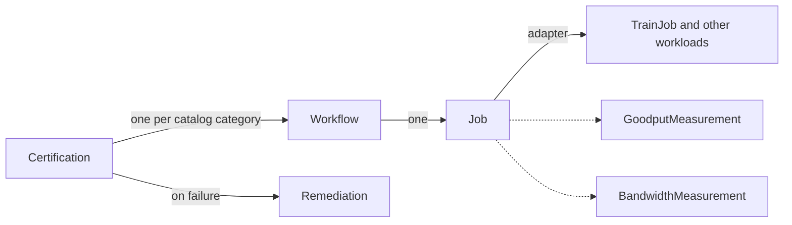

# Cluster Readiness Engine (CRE)

[](https://github.com/NVIDIA/cluster-readiness-engine/actions/workflows/ci.yml)
[](LICENSE)
[](go.mod)

New GPU clusters often contain faulty nodes, and those faults surface only under real distributed load. CRE is a Kubernetes controller that certifies GPU clusters before production workloads run on them. It runs real training and communication workloads across topology-aware node groups, measures performance, detects hardware failures, and quarantines bad nodes.

CRE is for platform and infrastructure teams that bring up, validate, or resell GPU clusters.

## Features

- A certification catalog with NCCL communication tests and multi-node training workloads
- Platform detection (AWS, GCP, Azure, TogetherAI) and GPU architecture detection (GB200, GB300, H100)
- Goodput measurement parsed from training logs with configurable LogProfile patterns
- Per-bus bandwidth measurement parsed from NCCL logs
- Node health monitoring with CEL expressions while workloads run
- Automatic remediation of failed nodes (taint and cordon, reversed on deletion)
- Topology-aware node grouping and adaptive fault isolation
- Checkpoint restart for training jobs
- WorkloadRun, a single resource to run a training, NCCL, or custom workload
- The `ncrectl` CLI for setup, render, run, report, and cleanup

## How it works

The APIs compose like Deployment, ReplicaSet, and Pod:



A Certification creates one Workflow per catalog category. Each Workflow creates a Job from its template. The Job creates the workload through an adapter, for example a Kubeflow Trainer TrainJob. Measurement resources parse pod logs with LogProfile regex patterns and compute goodput and bandwidth. When a node fails, a Remediation taints and cordons it. When you delete the Remediation, CRE removes the taint and the cordon.

## Quickstart

**1. Install the CLI**

```bash
curl -sSL https://github.com/NVIDIA/cluster-readiness-engine/releases/latest/download/installer | bash -s -- -p
```

The installer places `ncrectl` on your `$PATH` and creates a `kubectl-ncre` symlink so the CLI is also available as `kubectl ncre`.

**2. Set up the cluster**

```bash
kubectl ncre setup init --image-pull-secret "$(gh auth token)"
```

This installs Kubeflow Trainer, the CRE CRDs, the controller, and the built-in LogProfiles.

**3. Certify**

```bash
kubectl ncre certification run \
  --image-pull-secret "$(gh auth token)" \
  --category communication/nccl-all-reduce \
  --wait
```

**4. Report**

```bash
kubectl ncre certification report
```

```
╔════════════════════════════════════════════════════════════════╗
║                      Certification Report                      ║
╚════════════════════════════════════════════════════════════════╝

  Name:      ncrectl-20260806-162730
  Platform:  aws
  GPU:       gb300
  Nodes:     16

┌────────────────────────────────────────────────────────────────┐
│  communication/nccl-all-reduce                                 │
├────────────────────────────────────────────────────────────────┤
│  Status:    Succeeded                                          │
│  Runtime:   3m 56s                                             │
│  Scale:     full-scale                                         │
│  Nodes/Job: 16                                                 │
│  Jobs:      1                                                  │
│  MNNVL:     Enabled                                            │
│                                                                │
│  Bandwidth:                                                    │
│    Size       AlgBW        BusBW        Samples                │
│    16 GB      473.44 GB/s  932.09 GB/s  9                      │
└────────────────────────────────────────────────────────────────┘

┌────────────────────────────────────────────────────────────────┐
│  Summary                                                       │
├────────────────────────────────────────────────────────────────┤
│  Categories:   1/1 passed                                      │
│  Failed Nodes: none                                            │
│  Result:       PASSED                                          │
└────────────────────────────────────────────────────────────────┘
```

## Run a training workload

WorkloadRun is a simplified API for running training, NCCL, or custom workloads. Provide an image, framework, and node count. CRE detects the platform and GPU architecture.

```bash
kubectl ncre workloadrun run \
  --image-pull-secret "$(gh auth token)" \
  --image ghcr.io/nvidia/pytorch:26.01-py3 \
  --framework mpi \
  --mpi-binary /usr/local/bin/all_reduce_perf_mpi \
  --mpi-args "-b 8 -e 32G -f 2 -n 100" \
  --num-nodes 4 \
  --bandwidth-measurement \
  --wait
```

## Scope and non-goals

CRE certifies clusters with burn-in workloads and quarantines the nodes that fail. CRE is not:

- A continuous monitoring system. CRE watches nodes only while its workloads run.
- A general workload scheduler or a training platform for production pipelines.
- A benchmark leaderboard. The measurements exist to find faults, not to rank hardware.

## Documentation

- [Architecture Decision Records](docs/designs/) explain the design (ADR-000 to ADR-069).
- [CONTRIBUTING.md](CONTRIBUTING.md) describes the contribution workflow.
- [GOVERNANCE.md](GOVERNANCE.md) and [MAINTAINERS.md](MAINTAINERS.md) describe who decides what.
- [SECURITY.md](SECURITY.md) describes how to report a vulnerability.

A hosted documentation site is in progress.

## Roadmap

- First tagged release (v0.1.0) with `ncrectl` binaries and the Helm chart
- Hosted documentation site
- Signed artifacts, SBOMs, and build provenance in the release pipeline
- Branch protection and DCO checks for public contributions

## Community

- Ask questions in [GitHub Discussions](https://github.com/NVIDIA/cluster-readiness-engine/discussions).
- Report bugs and request features with the [issue templates](https://github.com/NVIDIA/cluster-readiness-engine/issues/new/choose).
- Report security issues per [SECURITY.md](SECURITY.md), never through GitHub issues.
- We follow the [Contributor Covenant Code of Conduct](CODE_OF_CONDUCT.md).

## Development

```bash
make manifests generate    # Regenerate CRDs and DeepCopy
make lint                  # Lint
make test                  # Unit + integration tests
make build                 # Build binary
```

Read [CONTRIBUTING.md](CONTRIBUTING.md) before you open a pull request. Open an issue first, and sign your commits with `git commit -s`.

## License

Copyright (c) 2026 NVIDIA CORPORATION & AFFILIATES. All rights reserved. Licensed under the Apache License, Version 2.0. See [LICENSE](LICENSE) for details. Third-party attributions are in [THIRD_PARTY_NOTICES.md](THIRD_PARTY_NOTICES.md).
