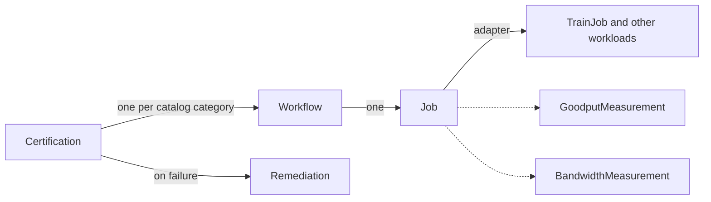

# Cluster Readiness Engine (CRE)

[](https://github.com/NVIDIA/cluster-readiness-engine/actions/workflows/ci.yml)
[](LICENSE)
[](go.mod)

New GPU clusters often contain faulty nodes, and those faults surface only under real distributed load. CRE is a Kubernetes controller that certifies GPU clusters before production workloads run on them. It runs real training and communication workloads across topology-aware node groups, measures performance, detects hardware failures, and quarantines bad nodes.

CRE is for platform and infrastructure teams that bring up, validate, or resell GPU clusters.

## Features

- A certification catalog with NCCL communication tests and multi-node training workloads
- Platform detection (AWS, GCP, Azure, TogetherAI) and GPU architecture detection (GB200, GB300, H100)
- Goodput measurement parsed from training logs with configurable LogProfile patterns
- Per-bus bandwidth measurement parsed from NCCL logs
- Node health monitoring with CEL expressions while workloads run
- Automatic remediation of failed nodes (taint and cordon, reversed on deletion)
- Topology-aware node grouping and adaptive fault isolation
- Checkpoint restart for training jobs
- WorkloadRun, a single resource to run a training, NCCL, or custom workload
- The `ncrectl` CLI for setup, render, run, report, and cleanup

## How it works

The APIs compose like Deployment, ReplicaSet, and Pod:



A Certification creates one Workflow per catalog category. Each Workflow creates a Job from its template. The Job creates the workload through an adapter, for example a Kubeflow Trainer TrainJob. Measurement resources parse pod logs with LogProfile regex patterns and compute goodput and bandwidth. When a node fails, a Remediation taints and cordons it. When you delete the Remediation, CRE removes the taint and the cordon.

## Install

```bash
# Install the CLI
curl -sSL https://github.com/NVIDIA/cluster-readiness-engine/releases/latest/download/installer | bash
# Include pre-release versions:
curl -sSL https://github.com/NVIDIA/cluster-readiness-engine/releases/latest/download/installer | bash -s -- -p

# Set up the cluster (installs Kubeflow Trainer, CRDs, controller, and LogProfiles)
ncrectl setup init
```

CI pushes the controller image to `ghcr.io/nvidia/cluster-readiness-engine/manager`. Tagged releases will carry the `ncrectl` binaries and the Helm chart.

## Certify a GPU cluster

```yaml
apiVersion: cre.nvidia.com/v1alpha1
kind: Certification
metadata:
  name: gpu-cluster-cert
spec:
  target:
    nodeSelector:
      nvidia.com/gpu.present: "true"
  categories:
    - domain: communication
      variant: nccl-all-reduce
    - domain: training
      variant: nemotron5-8b
```

```bash
kubectl apply -f certification.yaml
kubectl get certifications.cre.nvidia.com -w
```

Or run the full lifecycle with ncrectl (setup, run, report, cleanup):

```bash
ncrectl certification run --cert-file certification.yaml --image-pull-secret $NGC_API_KEY --wait
```

## Run a training workload

WorkloadRun is a simplified API for running training, NCCL, or custom workloads. Provide an image, framework, and node count. CRE detects the platform and GPU architecture.

```yaml
apiVersion: cre.nvidia.com/v1alpha1
kind: WorkloadRun
metadata:
  name: nccl-all-reduce
spec:
  image: nvcr.io/nvidia/pytorch:26.01-py3
  framework:
    mpi:
      binary: /usr/local/bin/all_reduce_perf_mpi
      args: ["-b", "8", "-e", "32G", "-f", "2", "-n", "100"]
  numNodes: 4
  bandwidthMeasurement:
    logProfileRef: nccl-bandwidth
    testType: all_reduce
```

```bash
ncrectl workloadrun run --image-pull-secret $NGC_API_KEY --wait my-workload.yaml
```

## Scope and non-goals

CRE certifies clusters with burn-in workloads and quarantines the nodes that fail. CRE is not:

- A continuous monitoring system. CRE watches nodes only while its workloads run.
- A general workload scheduler or a training platform for production pipelines.
- A benchmark leaderboard. The measurements exist to find faults, not to rank hardware.

## Documentation

- [Architecture Decision Records](docs/designs/) explain the design (ADR-000 to ADR-069).
- [CONTRIBUTING.md](CONTRIBUTING.md) describes the contribution workflow.
- [GOVERNANCE.md](GOVERNANCE.md) and [MAINTAINERS.md](MAINTAINERS.md) describe who decides what.
- [SECURITY.md](SECURITY.md) describes how to report a vulnerability.

A hosted documentation site is in progress.

## Roadmap

- First tagged release (v0.1.0) with `ncrectl` binaries and the Helm chart
- Hosted documentation site
- Signed artifacts, SBOMs, and build provenance in the release pipeline
- Branch protection and DCO checks for public contributions

## Community

- Ask questions in [GitHub Discussions](https://github.com/NVIDIA/cluster-readiness-engine/discussions).
- Report bugs and request features with the [issue templates](https://github.com/NVIDIA/cluster-readiness-engine/issues/new/choose).
- Report security issues per [SECURITY.md](SECURITY.md), never through GitHub issues.
- We follow the [Contributor Covenant Code of Conduct](CODE_OF_CONDUCT.md).

## Development

```bash
make manifests generate    # Regenerate CRDs and DeepCopy
make lint                  # Lint
make test                  # Unit + integration tests
make build                 # Build binary
```

Read [CONTRIBUTING.md](CONTRIBUTING.md) before you open a pull request. Open an issue first, and sign your commits with `git commit -s`.

## License

Copyright (c) 2026 NVIDIA CORPORATION & AFFILIATES. All rights reserved. Licensed under the Apache License, Version 2.0. See [LICENSE](LICENSE) for details. Third-party attributions are in [THIRD_PARTY_NOTICES.md](THIRD_PARTY_NOTICES.md).
