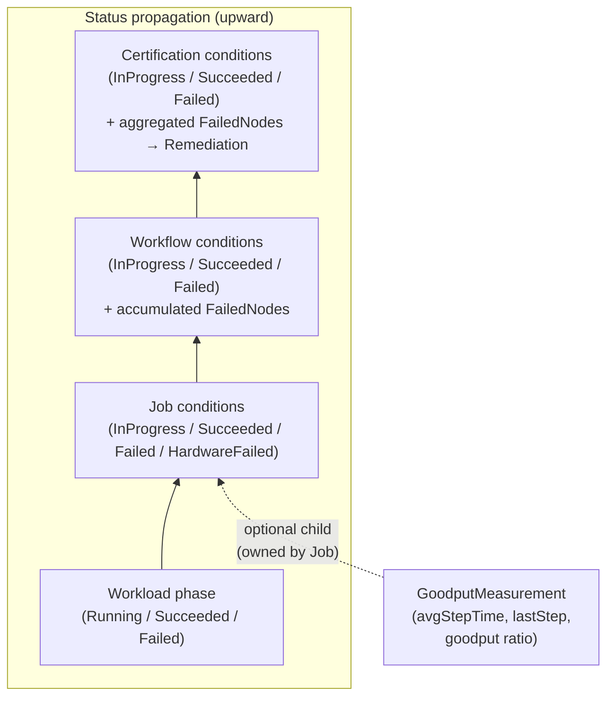
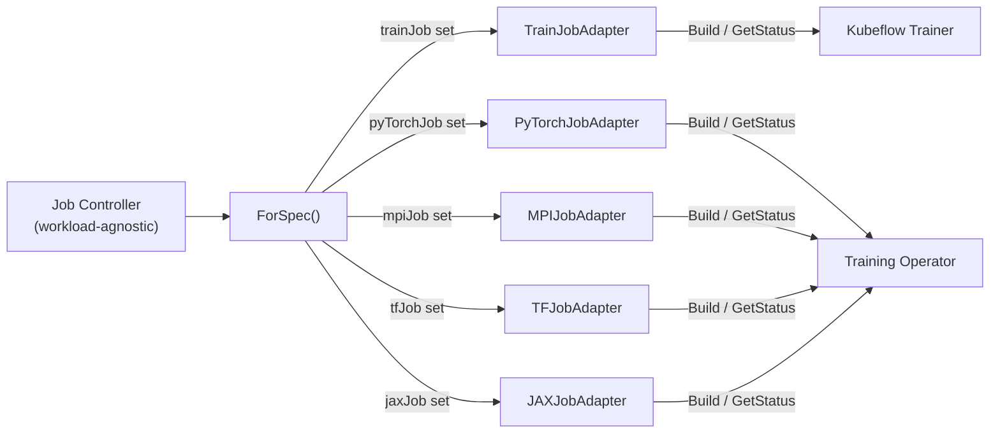
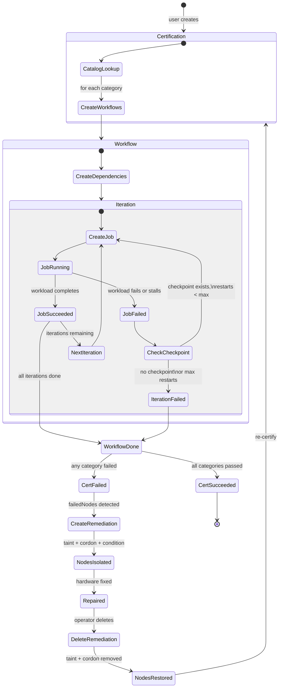

# ADR-000: CRE Architecture for GPU Cluster Certification

**Status:** Proposed
**Date:** 2026-02-10
**Deciders:** CRE Maintainers

## Context

GPU clusters used for distributed training need hardware burn-in before accepting production workloads. Faulty GPUs, degraded NVLink interconnects, or misconfigured networking cause silent training corruption, stalls, or cascading failures that waste expensive compute hours. Catching these faults requires real distributed training workloads that cycle GPUs between intense compute and idle pauses, stress the full infrastructure (VRAM, NVLink, storage I/O) simultaneously, and verify mathematical integrity, catching Silent Data Errors that synthetic tools miss. These workloads run for hours or days and need an orchestrator that continuously monitors the run, detects failures as they happen, and acts without human intervention.

Running burn-in today is painful and inadequate:

- **Manual and tedious.** Burn-in is done by hand: operators launch jobs, watch logs, track pass/fail per node in spreadsheets, and repeat across every cluster. No structured metrics, no programmatic status.
- **Existing Go test validation falls short.** Tests run short workloads that exit in minutes. They don't exercise sustained training over hours, don't handle mid-run failure and checkpoint restart, and don't use PVCs for model-data interaction.
- **No automation path.** New models and recipes must be added manually. A controller with a catalog API enables downstream systems (e.g., downstream orchestration systems) to register and trigger certifications programmatically.

The problem breaks down into three parts:

1. **Running workloads for burn-in.** Certification requires running real distributed training jobs (NCCL collective benchmarks, Nemotron pre-training, etc.) across groups of nodes. Different workload frameworks exist in the Kubernetes ecosystem (Kubeflow Trainer, Training Operator) and the burn-in system needs to work with all of them without being coupled to any one.

2. **Orchestrating multi-node, multi-iteration burn-in campaigns.** A full certification run involves multiple categories, each potentially running across different node groups (e.g., by NVLink clique), with multiple iterations per group, and with ordering and isolation constraints. This is beyond what a single Job resource can express.

3. **Detecting and acting on failures.** Hardware failures must be detected during workload execution (not just after), failed nodes must be identified, and the cluster state must be updated to prevent scheduling production workloads on bad hardware. Training workloads that stall (no forward progress) must be detected and restarted from checkpoint when possible, rather than running until timeout.

This system does not replace existing cluster readiness or platform checks (L0/L1 infrastructure checks, node provisioning gates, etc.). It solves a different problem: sustained hardware stress through real training workloads to surface latent faults that only appear under extended GPU/NVLink/network load. It is designed to compose with existing infrastructure health systems, not replace them.

## Requirements

### Goals

- Run burn-in workloads (distributed training, network benchmarks, storage stress tests) across groups of nodes and continuously monitor them for hours or days without human intervention.
- Detect hardware failures during workload execution — not just at completion — including GPU faults, NVLink degradation, training stalls, and poor goodput.
- Isolate nodes undergoing burn-in from tenant workloads so that burn-in and production traffic do not interfere with each other.
- Automatically isolate nodes that fail burn-in and restore them when hardware is repaired.
- Support multiple workload frameworks without coupling the controller to any specific one.
- Compose with existing GPU health systems through standard Kubernetes signals rather than custom integrations.
- Allow different levels of control: push-button certification for platform teams, individual workload execution for engineers debugging specific nodes.

### Non-Goals

- **Replacing existing platform readiness checks.** The cluster-readiness-engine does not replace infrastructure checks, node provisioning gates, or cluster validation systems. It solves a different problem — sustained hardware stress — and is designed to run after those systems, not instead of them.
- **GPU monitoring or diagnostics.** The cluster-readiness-engine does not implement GPU health monitoring. It consumes signals from systems that do (NVSentinel, gpud) via node conditions and taints.
- **Workload scheduling.** The cluster-readiness-engine does not implement its own scheduler. It relies on Kubernetes scheduling to place workloads on target nodes.
- **Multi-cluster orchestration.** The cluster-readiness-engine operates within a single Kubernetes cluster. Cross-cluster burn-in campaigns are out of scope.
- **Workload framework installation.** The controller requires at least one workload framework to be pre-installed. It does not install or manage these frameworks.
- **Prescribing specific burn-in workloads or pass/fail criteria.** The cluster-readiness-engine is a framework for orchestrating, monitoring, and remediating burn-in — it does not dictate which workloads to run, what parameters to measure, or what thresholds constitute a pass or fail. Those decisions belong to subject matter experts (SMEs) who understand the hardware being validated. The controller provides the catalog, adapter, and measurement extension points; SMEs populate them with the appropriate workloads (NCCL benchmarks for network bandwidth, pre-training runs for tokens-per-minute, fio for storage throughput, etc.) and health check expressions for their hardware.

### User Stories

#### Certify new nodes during cluster bring-up

As a **platform team**, I want to run a full burn-in certification suite against a batch of new GPU nodes by creating a single resource, so that I get a pass/fail result and a list of failed nodes without manually orchestrating individual workloads.

#### Debug a failing node

As a **hardware engineer**, I want to run a targeted stress workload against a specific node with health monitoring, so that I can determine whether the node has intermittent hardware issues without needing to set up a full certification suite.

#### Recertify nodes after repair

As a **cluster operator**, I want to restore a failed node to the schedulable pool after hardware repair by mutating the remediation request and re-running certification, so that the node is only returned to production after passing burn-in again.

#### Trigger burn-in automatically during cluster bring-up

As a **cluster validation system**, I want to trigger burn-in as part of the automated node onboarding pipeline, so that new or resized nodes are certified under sustained load before accepting production workloads without manual intervention.

#### Add a new burn-in category for a specific hardware dimension

As a **subject matter expert** (e.g., networking, storage, or GPU training), I want to define a new burn-in category — specifying the workload, iteration count, health check expressions, and measurement configuration — and register it in the catalog, so that platform teams can include it in their certification suites without understanding the underlying workload details.

#### Run non-training burn-in alongside GPU training

As a **platform team**, I want to include network (iperf), storage (fio), and GPU training categories in the same certification, each with their own measurement configuration, so that all hardware dimensions are stress-tested through a single burn-in campaign.

## Decision

We will build the cluster-readiness-engine as a set of layered Kubernetes CRDs — Certification, Workflow, and Job — following the same composition pattern that Kubernetes uses for Deployment → ReplicaSet → Pod. Each CRD addresses one level of abstraction: Job handles single workload execution with health monitoring, Workflow handles multi-node orchestration and iteration, and Certification handles burn-in suite composition with automatic remediation. Measurement APIs (GoodputMeasurement) run orthogonally alongside Jobs to assess training quality. A Remediation CRD handles post-failure node isolation.

## First Principles

The following principles guided every design decision in the cre. They are listed in priority order — when principles conflict, higher-priority principles win.

1. **Composability over completeness.** The cluster-readiness-engine does not try to be the single source of truth for node health. It is one component in a larger ecosystem that includes passive GPU monitoring (NVSentinel), platform readiness checks (k8s-platform-validator), and node-level diagnostics (gpud). Every design decision favors clean integration boundaries — Kubernetes-native signals (node conditions, taints, labels) as the interface, CEL for flexible signal consumption, and separation of detection from remediation so other systems can participate.

2. **Continuous observation over point-in-time checks.** Burn-in workloads run for hours or days. The controller must continuously watch workload status, parse training logs, evaluate node health, and detect stalls throughout the entire run — not just check results at the end. This drives the event-driven architecture.

3. **Layered abstraction over one-size-fits-all.** Different users need different levels of control. A platform team doing push-button certification needs a different interface than an engineer debugging a single node. The three-tier CRD hierarchy (Certification → Workflow → Job) lets each user operate at their level without being forced into abstractions they don't need.

4. **Detection and remediation are separate concerns.** Detecting that a node is unhealthy and deciding what to do about it are different problems with different owners. The cluster-readiness-engine detects failures through its own workload observation and through external signals (node conditions set by NVSentinel, gpud, etc.). Remediation is a separate CRD with its own lifecycle, enabling other systems to trigger or consume remediation actions independently.

5. **Workload-agnostic through adapters.** Burn-in is not limited to GPU training. Network validation, storage burn-in, and other non-GPU workloads are equally valid burn-in categories. The adapter pattern isolates workload-specific logic (object construction, status mapping) behind a common interface, so any workload type that can run on Kubernetes can be orchestrated by the cre. The core orchestration (scheduling, health monitoring, iteration, remediation) works uniformly regardless of what the workload actually does.

6. **Orthogonal, opt-in measurement.** Measurement is decoupled from orchestration. The system supports multiple measurement types, each as an independent API that runs alongside a Job. Jobs declare which measurements they want to report — a training workload opts into goodput tracking, a network workload might opt into throughput measurement, and a storage workload might opt into IOPS measurement. Jobs that need no measurement simply omit it. This keeps measurement concerns out of the core orchestration path and allows new measurement types to be added without changing the Job or Workflow controllers.

7. **Kubernetes-native signals as the integration contract.** The cluster-readiness-engine reads and writes standard Kubernetes primitives: node conditions, taints, labels, and owner references. This means any system that speaks Kubernetes can integrate with it without custom APIs or adapters.

## Implementation

### Software Components

The cluster-readiness-engine is a single Go binary built on controller-runtime. The diagram below shows the components inside the controller, the CRDs it manages, and the external systems it interacts with.

```
┌─────────────────────────────────────────────────────────────────────────┐
│  Control Plane                                                          │
│                                                                         │
│  ┌──────────────────────┐ ┌──────────────────┐ ┌──────────────────────┐ │
│  │ CRE   │ │ Workload         │ │ NVSentinel           │ │
│  │ (single binary)      │ │ Frameworks       │ │ (Deployment)         │ │
│  │                      │ │                  │ │                      │ │
│  │ manages:             │ │ Kubeflow Trainer │ │ fault management     │ │
│  │ Certification,       │ │ Training Operator│ │                      │ │
│  │ Workflow, Job,       │ │                  │ │                      │ │
│  │ GoodputMeasurement,  │ │                  │ │                      │ │
│  │ Remediation          │ │                  │ │                      │ │
│  └──────────┬───────────┘ └────────┬─────────┘ └──────────┬───────────┘ │
│             │                      │                      │             │
└─────────────┼──────────────────────┼──────────────────────┼─────────────┘
              │                      │                      │
              │ reads/writes         │ creates/watches      │ fault
              │ CRDs, taints,        │ workload CRDs,       │ management
              │ labels, conditions   │ schedules pods       │
              ▼                      ▼                      ▼
┌──────────────────────────────────────────────────────────────────────────┐
│                       Kubernetes API Server                              │
│                                                                          │
│  Burn-in CRDs    Workload CRDs    Node Objects    Measurement CRDs       │
└──────────────────────────────────────────────────────────────────────────┘
              ▲                      ▲
              │                      │
              │ writes node          │ reports
              │ conditions + taints  │ pod status
              │                      │
┌─────────────┼──────────────────────┼─────────────────────────────────────┐
│  GPU Node   │                      │                                     │
│             │                      │                                     │
│  ┌──────────┴───────────┐ ┌────────┴─────────┐                           │
│  │ NVSentinel / gpud    │ │ Workload Pod     │                           │
│  │ (DaemonSets)         │ │                  │                           │
│  │                      │ │ training,        │                           │
│  │ fault detection      │ │ benchmark, or    │                           │
│  │                      │ │ stress workload  │                           │
│  │                      │ │                  │                           │
│  └──────────────────────┘ └──────────────────┘                           │
│                                                                          │
└──────────────────────────────────────────────────────────────────────────┘

Optional:
┌──────────────────────────────────────────────────────────────────────────┐
│  k8s-platform-validator                                                  │
│                                                                          │
│  Detects new/resized nodes ──► triggers burn-in via TestProvider CRD     │
│  Reads burn-in results via CRD status                                    │
└──────────────────────────────────────────────────────────────────────────┘
```

**Internal components** (part of the controller binary):

| Component                      | Responsibility                                                                                    |
| ------------------------------ | ------------------------------------------------------------------------------------------------- |
| Certification Reconciler       | Creates Workflows from catalog, taints nodes for isolation, creates Remediation on failure        |
| Workflow Reconciler            | Applies orchestration target, manages iterations, accumulates failed nodes                        |
| Job Reconciler                 | Creates workloads via adapter, runs CEL health checks, creates GoodputMeasurement, labels nodes   |
| GoodputMeasurement Reconciler  | Parses pod logs via LogProfile, computes goodput ratio, publishes stall detection metrics         |
| Remediation Reconciler         | Taints, cordons, and sets conditions on failed nodes; reverses on deletion                        |

**External dependencies** (must be pre-installed):

| Component          | Role                                                                                    | If Unavailable                                                                                                                                  |
| ------------------ | --------------------------------------------------------------------------------------- | ----------------------------------------------------------------------------------------------------------------------------------------------- |
| Kubernetes API     | Stores all CRDs, handles watches, runs admission validation                             | Complete halt. Controller cannot reconcile. Running workloads continue independently. Existing taints and conditions persist (fail-safe).        |
| Workload Framework | At least one of: Kubeflow Trainer, Training Operator. Runs workload pods, reports status | Workload creation fails. Jobs remain InProgress. Existing workloads already running continue. Controller retries on next reconciliation.         |

**External integrations** (optional, none required):

| Component              | Interaction                                                                                                | If Unavailable                                                                                                                           |
| ---------------------- | ---------------------------------------------------------------------------------------------------------- | ---------------------------------------------------------------------------------------------------------------------------------------- |
| NVSentinel             | Writes node conditions/taints that the controller reads via CEL; reads burn-in labels via MetadataAugmentor | CEL expressions referencing NVSentinel conditions evaluate to false. Burn-in continues; hardware failures detectable only via workload-level signals. |
| k8s-platform-validator | Can trigger burn-in via TestProvider CRD; reads burn-in results via CRD status                              | Burn-in is not triggered automatically. Manual Certification creation still works. Existing certifications are unaffected.                |

### Architecture Overview

```
┌────────────────────────────────────────────────────────────────────────────────┐
│                              Kubernetes Cluster                                │
│                                                                                │
│  ┌─────────────────┐   creates   ┌──────────────┐   creates   ┌───────────┐    │
│  │  Certification  │───────────► │   Workflow   │───────────► │    Job    │    │
│  └────────┬────────┘             └──────┬───────┘             └─────┬─────┘    │
│           │                             │                           │          │
│           │ on failure                  │                           │          │
│           ▼                             ▼                           │          │
│  ┌─────────────────┐       ┌────────────────────┐    creates        │          │
│  │  Remediation    │       │ GoodputMeasurement │◄────────────────  │          │
│  │  - taints       │       │ - parses logs      │   (optional)      │          │
│  │  - cordons      │       │ - computes goodput │                   │          │
│  │  - conditions   │       │ - tracks stalls    │                   │          │
│  │    on nodes     │       └────────────────────┘                   │          │
│  └────────┬────────┘                                       creates  │          │
│           │                                                workload │          │
│           ▼                                                         ▼          │
│  ┌─────────────────┐                                   ┌─────────────────────┐ │
│  │  Affected       │                                   │      Workload       │ │
│  │  Nodes:         │                                   │  TrainJob           │ │
│  │  - tainted      │                                   │  PyTorchJob         │ │
│  │  - cordoned     │                                   │  MPIJob / TFJob     │ │
│  │  - conditioned  │                                   │  JAXJob             │ │
│  │                 │                                   └──────────┬──────────┘ │
│  └─────────────────┘                                              │            │
│                                                                   ▼            │
│                              CEL health                  ┌─────────────┐       │
│                              evaluation ◄──────────────  │    Nodes    │       │
│                                                          └─────────────┘       │
└────────────────────────────────────────────────────────────────────────────────┘
```

### CRD Hierarchy

```
Certification          creates →   Workflow(s)
Workflow               creates →   Job(s)
Job                    creates →   Workload (TrainJob | PyTorchJob | MPIJob | TFJob | JAXJob)
Job                    creates →   GoodputMeasurement (optional, when spec.goodputMeasurement is set)
GoodputMeasurement     watches →   Job (reads pod logs)
Remediation            acts on →   Node(s)
```

Each level creates and owns resources at the level below via `SetControllerReference()`. Status conditions propagate upward through the hierarchy. Hardware failure information (failed node lists) also propagates upward and accumulates across iterations. Certification and Remediation are cluster-scoped — they target nodes across the cluster and are created by cluster administrators. All other CRDs (Workflow, Job, GoodputMeasurement) are namespace-scoped, allowing standard Kubernetes RBAC to control who can observe or interact with burn-in resources within a namespace.



### Job Controller

The Job CRD is the lowest level of the hierarchy. It takes a `WorkloadSpec` (a discriminated union — exactly one of `trainJob`, `pyTorchJob`, `mpiJob`, `tfJob`, `jaxJob` must be set, enforced by CRD validation) and creates the corresponding workload resource.

Key responsibilities:

- **Workload lifecycle.** Creates the workload, watches for status changes via `Owns()` watches on child resources, and maps workload-specific status to normalized conditions (InProgress / Succeeded / Failed).
- **Hardware failure detection.** Evaluates user-provided CEL expressions against Node objects for all nodes running the Job's pods. Pod-to-Job mapping uses the `cre.nvidia.com/job` label, auto-injected into workload pod templates by the adapter layer. Failed nodes are recorded additively (never removed) to prevent flapping from hiding intermittent failures.
- **GoodputMeasurement creation.** When `spec.goodputMeasurement` is set, the Job controller creates a child GoodputMeasurement (named `<job>-goodput`) owned by the Job via `SetControllerReference()`. The config specifies `logProfileRef` (required), `sampleInterval` (default 60s), and `tailLines` (default 1000). The field is immutable after creation. When `spec.goodputMeasurement` is absent, no measurement is created — this makes goodput tracking opt-in and allows non-training workloads to skip it entirely.
- **Checkpoint restart.** When `spec.checkpoint` is configured and a checkpoint was recorded by the associated GoodputMeasurement, the controller deletes the failed workload, clears the workload reference, and lets the next reconcile recreate it. `maxRestarts` caps the retry count.
- **Stall detection.** When `spec.stallMultiplier` is set, the controller compares elapsed time since the last training step (from GoodputMeasurement status) against `stallMultiplier * avgStepTime`. If exceeded, the workload is marked Failed with reason `WorkloadStalled`. If checkpoint restart is also configured, it restarts before failing terminally. If no GoodputMeasurement exists, stall detection is effectively disabled.
- **Node labeling during burn-in.** The Job controller applies a label (`cre.nvidia.com/status=burning-in`) to all nodes running the Job's workload pods while the Job is active, and removes it when the Job reaches a terminal state. This is a general-purpose signal — any external system that reads node labels can use it to distinguish nodes under burn-in from nodes running production workloads. NVSentinel's MetadataAugmentor is one consumer (see [NVSentinel integration](#nvsentinel)), but the label is equally useful for Prometheus alerting rules, dashboard filters, or custom operators that need to suppress or annotate alerts during burn-in.

The workload field is immutable after creation (enforced via CEL validation rules on the CRD). This avoids the complexity of workload update semantics and makes the Job's intent clear from creation.

### Workload Adapter Pattern

The Job controller does not contain workload-specific logic. Instead, an `Adapter` interface (`pkg/workload/adapter.go`) defines seven methods: `GVK`, `NewObject`, `Build`, `InjectPodLabel`, `SetNodeSelector`, `SetNodeAffinity`, `GetStatus`. Five concrete adapters implement this interface:

| Adapter            | Framework           | Status Source                                          |
| ------------------ | ------------------- | ------------------------------------------------------ |
| `TrainJobAdapter`  | Kubeflow Trainer v2 | `metav1.Condition` (TrainJobComplete / TrainJobFailed) |
| `PyTorchJobAdapter`| Training Operator   | `kubeflowv1.JobCondition`                              |
| `MPIJobAdapter`    | Training Operator   | `kubeflowv1.JobCondition`                              |
| `TFJobAdapter`     | Training Operator   | `kubeflowv1.JobCondition`                              |
| `JAXJobAdapter`    | Training Operator   | `kubeflowv1.JobCondition`                              |

A `ForSpec()` factory selects the adapter based on which field is set in `WorkloadSpec`. The Kubeflow Training Operator adapters share helpers (`kubeflow_helpers.go`) for common operations on ReplicaSpecs. For status normalization, Failed takes precedence over Succeeded when both conditions are present.



Adding a new workload type requires: (1) implement the `Adapter` interface, (2) add a case to `ForSpec()`, (3) add an `Owns()` watch in `SetupWithManager`.

### Workflow Controller

The Workflow CRD handles orchestration: which nodes to target, how to group them, how many iterations to run, and what dependencies to create. It takes a `jobTemplate` and creates Jobs from it.

Key responsibilities:

- **Target application.** The Workflow's `orchestration.target` (nodeSelector or nodeNames) is applied to each Job's workload via the adapter's `SetNodeSelector` / `SetNodeAffinity` methods. The Workflow does not modify the Job spec — it modifies the workload that the Job will create.
- **Iteration management.** For `iterations: N`, the Workflow creates N sequential Jobs per group, naming them `<workflow>-job` (N=1) or `<workflow>-iter-<N>` (N>1). It waits for each Job to reach a terminal state before creating the next. Failed iterations increment a counter; the Workflow fails if any iteration fails.
- **Dependency management.** `spec.dependencies[]` uses `runtime.RawExtension` to embed arbitrary Kubernetes resources (ConfigMaps, ServiceAccounts, custom resources). Scope (workflow vs job) is inferred from the reference graph — see [ADR-034](034-inferred-dependency-lifecycle.md). All dependencies are automatically deleted on Workflow completion.
- **Hardware failure accumulation.** Failed nodes from each Job iteration are merged into the Workflow's failed node list.

### Certification Controller

The Certification CRD is the highest level. It takes a target (node selector) and a list of categories (domain/variant pairs), looks each up in the catalog, and creates a Workflow per category.

- **Node isolation during burn-in.** Before creating Workflows, the Certification controller applies a taint (key: `cre.nvidia.com/status`, value: `BurningIn`, effect: `NoExecute`) to all target nodes. This prevents tenant workloads from being scheduled onto (or remaining on) nodes that are undergoing burn-in — without this, a tenant workload landing on a burn-in node could interfere with stress results or be disrupted by the burn-in workload itself. Monitoring and breakfix applications (NVSentinel, gpud, etc.) tolerate this taint so they continue operating during burn-in. The cluster-readiness-engine's own workload pods also tolerate it. The taint is removed when the Certification completes successfully or when it is deleted. If the Certification fails, the taint is replaced by the Remediation taint (key: `cre.nvidia.com/preflight-failed`, effect: `NoExecute`), ensuring the node remains isolated until the hardware is repaired.
- **Catalog pattern.** The catalog (`pkg/catalog/`) is a global registry mapping `{domain, variant}` to an `Entry` with a `Build(target) WorkflowSpec` function. Categories register themselves via `init()` functions — adding a new burn-in category (e.g., `training/nccl`, `network/iperf`, `storage/fio`) means adding a single Go file with an `init()` function. No controller code changes needed. The catalog is the primary extension point through which subject matter experts define what to burn in and how. Each category encodes the full WorkflowSpec — workload type, iteration count, health check expressions, measurement configuration, and dependencies — so the controller itself remains agnostic to what is being validated. This separation is what enables new GPU hardware generations (e.g., H100 → B200 → future architectures) to be supported without controller code changes — the controller does not contain hardware-specific logic. A new hardware generation means new catalog entries (potentially with different workloads, different CEL expressions for new fault modes, different iteration counts) but the same controller binary. Catalog entries are also responsible for test correctness — workloads should be designed to fail explicitly on configuration errors rather than silently succeed with a short or no-op run. If a misconfigured workload exits successfully and no hardware failures are detected via CEL, the controller treats the certification as passed, because the controller is agnostic to what constitutes a valid test — that judgment belongs to the catalog author. This is by design: the controller orchestrates, monitors, and remediates; the catalog defines what correctness means for each burn-in category.
- **Remediation.** When any Workflow reports failed nodes, the Certification controller creates a `Remediation` resource listing those nodes. The Remediation controller then taints each node (`cre.nvidia.com/preflight-failed:NoExecute`), cordons it, and adds a node condition (`cre.nvidia.com/PreflightCheckFailed`). All actions are reversed when the Remediation is deleted, allowing re-certification after repair.
- **Workflow execution ordering.** Workflows within a Certification can run concurrently or sequentially, configurable per-Certification. The only invariant the controller enforces is that no two Workflows from the same Certification target the same node simultaneously — this prevents resource contention and ambiguous failure attribution. If a Workflow fails, the Certification's behavior depends on configuration: independent mode continues remaining Workflows to completion (maximizing diagnostic coverage per certification run), while fail-fast mode cancels siblings. Partial creation (e.g., 3 of 5 Workflows created before an API server error) is handled by the standard idempotent reconciliation loop — the next reconcile creates the remaining Workflows and skips those that already exist.
- **Taint safety.** The Certification controller uses a finalizer to guarantee that burn-in taints are cleaned up even if the Certification is deleted mid-run. The `handleDeletion` path removes the `cre.nvidia.com/status` taint from all target nodes before the finalizer is released. This prevents the worst case of orphaned `NoExecute` taints permanently reducing cluster capacity. If the controller itself is unavailable, taints persist (fail-safe) — nodes remain isolated rather than prematurely re-exposed to tenant workloads. A configurable `maxRemediationNodes` threshold (percentage of target nodes) prevents a single misconfigured CEL expression or transient infrastructure issue from remediating the entire target set in one pass — if the threshold is exceeded, the Certification fails with a `RemediationThresholdExceeded` condition, leaving diagnosis to the operator rather than proceeding with mass remediation.

### GoodputMeasurement Controller

GoodputMeasurement tracks training efficiency for a referenced Job. It is typically created automatically by the Job controller when `spec.goodputMeasurement` is configured, but can also be created manually and linked to an existing Job via `spec.jobRef`. The GoodputMeasurement periodically fetches pod logs, parses them using a cluster-scoped `LogProfile` (regex patterns with named capture groups), and computes training efficiency.

The goodput ratio:

```
goodput = (t_w - t_ch - t_re - t_rm - t_save) / (t_w - t_re)
```

| Symbol   | Component       | Description                                                   |
| -------- | --------------- | ------------------------------------------------------------- |
| `t_w`    | Training time   | Total wall-clock time from first training step to job end     |
| `t_ch`   | Lost work       | Time between last checkpoint and each interruption            |
| `t_re`   | Reschedule time | Scheduling delay after each interruption                      |
| `t_rm`   | Resume time     | Checkpoint load + resume time after each restart              |
| `t_save` | Checkpoint save | Cumulative overhead of saving checkpoints during training     |

For stall detection, GoodputMeasurement publishes `avgStepTimeSec` and `lastStepTimestamp` in its status, which the Job controller reads. Warmup iterations (first iteration, which is typically much slower) are excluded from the average.

Interruption detection persists pending interruptions in the status object (not just in-memory) so state survives controller restarts.

### Certification Lifecycle

The following diagram shows the end-to-end lifecycle of a burn-in certification, from initial creation through to remediation and re-certification after repair.



### Controller Patterns

All controllers share these patterns:

- **Event-driven, level-triggered reconciliation.** Controllers use `Owns()` watches on child resources for immediate status propagation. Reconciliation is level-triggered: each reconcile evaluates the full current state of the resource and its children, rather than reacting to the specific event that triggered it. This means the controller is robust to missed events, event coalescing, and watch restarts — if the controller misses an intermediate state change, the next reconcile converges to the correct state regardless. This is critical for long-running burn-in workloads where detecting a failure minutes earlier can save hours of wasted GPU time.
- **Exclusive conditions.** A `setExclusiveCondition()` helper ensures InProgress, Succeeded, and Failed are mutually exclusive via `meta.SetStatusCondition()`, with `observedGeneration` set on every condition update so consumers can detect stale conditions relative to spec changes. The exception is Job's `HardwareFailed` condition, which is independent — a Job can be both Succeeded and HardwareFailed (the workload completed, but hardware issues were detected during execution). Terminal states (Succeeded, Failed) are final: once a resource reaches a terminal state, the controller does not re-evaluate it. Re-certification requires creating a new Certification resource. This prevents ambiguous state where a resource oscillates between terminal conditions and simplifies consumer logic — a terminal condition with `observedGeneration` matching the current generation is authoritative.
- **Finalizers with explicit cleanup.** All controllers add finalizers and explicitly delete child resources in `handleDeletion`. This provides deterministic cleanup and logging rather than relying solely on garbage collection.
- **Idempotent creation and self-healing.** Child resource references are stored in status (WorkloadRef, JobRef, DependencyRefs). If the reference already exists, the controller verifies the referenced resource still exists — if it has been externally deleted, the reference is cleared and the resource is recreated on the next reconcile. If creation returns AlreadyExists, the existing resource is fetched and used. This makes the controller resilient to manual intervention: an operator can delete a misbehaving workload and the controller will recreate it from the parent's spec.
- **No in-memory state.** All progress — workload references, failed node lists, iteration counts, interruption tracking, checkpoint data — is persisted in CRD status subresources. The controller can be restarted, upgraded, or failed over at any point during a multi-hour certification and will reconstruct its state from the API server on the next reconciliation. This is what makes mid-certification upgrades safe: a new controller version picks up exactly where the old one left off.
- **Leader election.** The controller runs as a single-replica Deployment with controller-runtime's built-in leader election via a Lease object. This prevents split-brain scenarios where two instances could simultaneously taint nodes or create workloads. If the leader pod is killed, a new pod acquires the lease and resumes reconciliation from persisted state.
- **Liveness and readiness probes.** The controller exposes `/healthz` (liveness) and `/readyz` (readiness) endpoints via controller-runtime's health infrastructure. Liveness detects deadlocked reconciliation loops; readiness gates traffic until informer caches are synced. Failed probes trigger pod restart, and the new instance resumes from persisted state.
- **Least-privilege RBAC.** The controller's ClusterRole is scoped to the minimum required permissions: get/list/watch/create/patch/delete on burn-in CRDs and their status subresources; get/list/watch on workload CRDs (TrainJob, PyTorchJob, etc.); get/list/watch on Pods and Nodes; get on `pods/log` (for GoodputMeasurement log parsing); patch on Node status and spec (for taints, labels, conditions). No permissions on secrets, configmaps, or cluster-level resources beyond nodes. Each permission maps to a specific controller responsibility. Because the controller performs privileged node mutations (tainting, cordoning, setting conditions) on behalf of CRD authors, access control on who can create burn-in resources is the cluster administrator's responsibility. Certification is cluster-scoped, so standard Kubernetes RBAC on the Certification resource controls who can initiate burn-in campaigns and the resulting node mutations. The controller does not perform authorization checks beyond what the API server enforces — it trusts that if a Certification was admitted, the author had permission to create it.
- **CRD schema compatibility.** Status subresource changes are additive only — new fields with zero-value defaults. This ensures that rolling back the controller to a previous version does not break reconciliation: the old version ignores unknown status fields, and the new version populates them on next reconcile. Spec changes follow the same principle during `v1alpha1`; a CRD conversion webhook will handle cross-version translation starting at `v1beta1`.

### Node Health Monitoring

Hardware failure detection uses a pluggable `NodeFailureDetector` interface. The CEL implementation evaluates user-provided expressions against the full Node object at reconciliation time. Common patterns:

```
node.spec.unschedulable == true
node.spec.taints.exists(t, t.key == 'nvidia.com/gpu-unhealthy')
!node.status.conditions.exists(c, c.type == 'Ready' && c.status == 'True')
```

This is the primary integration point for external health systems. NVSentinel sets node conditions like `GpuMemWatch`, `SysLogsXIDError`, and `GpuNvlinkWatch`. gpud reports health via its own mechanisms. The cluster-readiness-engine does not need to know about these systems directly — it reads whatever conditions, taints, or labels they produce through CEL expressions configured by the operator. For example, to incorporate NVSentinel's GPU health signals:

```
node.status.conditions.exists(c, c.type == 'GpuMemWatch' && c.status == 'True') ||
node.status.conditions.exists(c, c.type == 'SysLogsXIDError' && c.status == 'True')
```

Node-to-Job mapping: the adapter layer injects a `cre.nvidia.com/job` label into all workload pod templates. A field index on this label enables efficient pod lookups per Job. Pods are grouped by `spec.nodeName` to determine which nodes are running each Job's workloads.

## Composability and Integrations

The cluster-readiness-engine is designed to be one component in a larger GPU operations ecosystem. It focuses on sustained workload-based stress and certification. Other systems handle complementary concerns: passive hardware monitoring, platform readiness, and node-level diagnostics. The integration contract is Kubernetes-native signals — node conditions, taints, labels — rather than custom APIs. No external system requires the cluster-readiness-engine to function — if the controller is unavailable, NVSentinel continues monitoring, k8s-platform-validator continues gating nodes, and gpud continues reporting health. The only impact is that automated burn-in certification is paused until the controller recovers.

```
┌──────────────────────────────────────────────────────────────────────────┐
│                              GPU Node                                    │
│                                                                          │
│  ┌───────────────┐     ┌───────────────┐                                 │
│  │     gpud      │     │  NVSentinel   │                                 │
│  │  (DaemonSet)  │     │  GPU Health   │                                 │
│  │  XID, ECC,    │     │  Monitor      │                                 │
│  │  NVLink,      │     │  (DaemonSet)  │                                 │
│  │  thermals     │     │  DCGM, XID,   │                                 │
│  │               │     │  SXID         │                                 │
│  └───────┬───────┘     └───────┬───────┘                                 │
│          │                     │                                         │
└──────────┼─────────────────────┼─────────────────────────────────────────┘
           │ writes              │ writes
           ▼                     ▼
┌──────────────────────────────────────────────────────────────────────────┐
│                       Kubernetes Node Object                             │
│                                                                          │
│  status.conditions:                    spec.taints:                      │
│  ├─ GpuMemWatch: True                 ├─ nvidia.com/gpu-unhealthy        │
│  ├─ SysLogsXIDError: True             ├─ cre.nvidia.com/preflight-... │
│  ├─ GpuNvlinkWatch: False             └─ cre.nvidia.com/...  │
│  └─ cre.nvidia.com/                                                   │
│     PreflightCheckFailed: True         spec.unschedulable: true/false    │
│                                                                          │
└──────────────────────────────┬───────────────────────────────────────────┘
                               │ reads via CEL
                               ▼
┌──────────────────────────────────────────────────────────────────────────┐
│                        CRE                                │
│                                                                          │
│  Certification ──► Workflow ──► Job ──► Workload                         │
│       │                                    │                             │
│       │ on failure          GoodputMeasurement ──► pod logs              │
│       ▼                                                                  │
│  Remediation ──► taints, cordons, conditions on nodes                    │
│                                                                          │
└──────────────────────────────┬───────────────────────────────────────────┘
                               │ writes taints, conditions
                               ▼
┌──────────────────────────────────────────────────────────────────────────┐
│                    k8s-platform-validator                                │
│                                                                          │
│  Node Validation Manager ──► ClusterValidation CR ──► TestProvider       │
│       │                                                    ▲             │
│       │ detects new/resized nodes                          │             │
│       └──── can trigger burn-in as L2 TestProvider ────────┘             │
│                                                                          │
└──────────────────────────────────────────────────────────────────────────┘
```

### NVSentinel

[NVSentinel](https://github.com/NVIDIA/NVSentinel) is a GPU node resilience system that continuously monitors hardware health through DCGM metrics, syslog (XID/SXID errors), and cloud provider signals. When it detects a fault, it quarantines the node (cordon + optional taint), drains workloads, and triggers remediation (reboot, GPU reset, or node termination).

**How the cluster-readiness-engine composes with NVSentinel:**

- **Consuming NVSentinel signals during burn-in.** NVSentinel sets node conditions (`GpuMemWatch`, `SysLogsXIDError`, `GpuNvlinkWatch`, etc.) and optionally applies taints when it detects faults. The cluster-readiness-engine's CEL-based health monitor can evaluate these conditions directly. This means the cluster-readiness-engine benefits from NVSentinel's GPU monitoring without reimplementing DCGM integration. If NVSentinel detects a faulty GPU on a node running a burn-in workload, the cluster-readiness-engine sees it through the node condition and records the hardware failure.

- **Complementary fault detection.** NVSentinel monitors hardware passively — it watches DCGM counters and system logs for errors. The cluster-readiness-engine actively stresses hardware by running real training workloads to provoke latent faults that only appear under sustained load. NVSentinel catches faults that emerge during burn-in (ECC errors, NVLink failures, thermal issues), while the cluster-readiness-engine catches workload-level problems (stalls, poor goodput, NCCL timeouts) that passive monitoring cannot see. Together they provide broader coverage than either alone.

- **Coordinating remediation.** Both systems can quarantine nodes — NVSentinel through its fault-quarantine module, the cluster-readiness-engine through its Remediation CRD. In practice, they operate at different times: NVSentinel runs continuously during and after burn-in, while the cluster-readiness-engine's Remediation acts on certification results. If NVSentinel quarantines a node during a burn-in run, the cluster-readiness-engine sees the resulting node condition or taint through CEL and records it as a hardware failure. If the cluster-readiness-engine detects a fault that NVSentinel missed (e.g., poor goodput from a workload-level stall), the Remediation CRD taints and cordons the node, which NVSentinel's state machine can observe.

- **NVSentinel's Kubernetes Object Monitor** can be configured with CEL policies that watch burn-in CRDs. This allows NVSentinel to generate health events when burn-in certifications fail, feeding burn-in results into NVSentinel's event store and remediation pipeline without any custom code.

- **Distinguishing burn-in failures from production failures.** The Job controller applies a `cre.nvidia.com/status=burning-in` label to nodes during burn-in (see [Job Controller](#job-controller)). NVSentinel's Platform Connector includes a MetadataAugmentor transformer that enriches every health event with node labels configured in its `allowedLabels` whitelist. If this whitelist includes the burn-in label, every health event emitted during burn-in will carry it in the `HealthEvent.Metadata` map. This enables two things: (1) operations teams can filter NVSentinel dashboards and alerts to distinguish hardware errors caught during burn-in from errors during regular production workloads, and (2) over time, the data provides a measure of burn-in effectiveness — by comparing the rate of hardware errors on nodes that went through burn-in versus those that did not, or by tracking what fraction of total hardware errors are caught during the burn-in phase rather than later in the node's lifecycle.

### k8s-platform-validator (Cluster Validation System)

The k8s-platform-validator is a cluster readiness system that runs layered checks: L0 (per-node health and configuration), L1 (multi-node fabric NCCL benchmarks), and L2 (synthetic AI workloads like Nemotron). It gates node readiness through taints — nodes are born tainted and only untainted after passing checks. It is driven by the `ClusterValidation` and `TestProvider` CRDs.

**How the cluster-readiness-engine composes with k8s-platform-validator:**

- **Different problems, different timescales.** The k8s-platform-validator gates node readiness at provisioning time — it answers "is this node configured correctly and minimally functional?" The cluster-readiness-engine answers a different question: "does this hardware hold up under sustained training workloads over hours or days?" A node can pass all L0/L1/L2 readiness checks and still have a latent GPU memory fault that only surfaces after 4 hours of continuous pre-training. The cluster-readiness-engine's value is in the sustained stress, not the initial gate.

- **Sequential composition.** In a typical deployment, the k8s-platform-validator runs first (gating nodes at provisioning), and the cluster-readiness-engine runs after (certifying hardware under sustained load). The k8s-platform-validator untaints nodes after they pass readiness checks; the cluster-readiness-engine's Certification then targets those nodes for extended burn-in. If burn-in fails, the Remediation CRD re-taints the node with `cre.nvidia.com/preflight-failed:NoExecute`.

- **The cluster-readiness-engine could be registered as a TestProvider** within the cluster validation system. The `TestProvider` CRD supports custom providers with arbitrary pod templates. A burn-in Certification or Workflow could be wrapped as a TestProvider, allowing the cluster validation system to orchestrate burn-in as an L2 suite. This composition is what enables burn-in to run automatically during new cluster bring-ups and cluster resizes — the Node Validation Manager detects new nodes, creates a `ClusterValidation` CR, and the burn-in TestProvider handles the sustained workload stress without any manual trigger. No code changes needed in either system; the integration is purely at the CRD boundary.

### gpud

[gpud](https://github.com/leptonai/gpud) is a per-node GPU monitoring daemon that provides continuous hardware health assessments. It runs as a DaemonSet and monitors GPU health through DCGM, system logs (XID/SXID errors), hardware slowdown events, ECC errors, NVLink status, and more. It exposes a local REST API per node with health states (Healthy / Unhealthy / Degraded) and suggested repair actions.

**How the cluster-readiness-engine composes with gpud:**

- **On-demand health probing.** gpud's `/v1/components/trigger-check` endpoint allows active health checks, not just passive monitoring. A future integration could have the cluster-readiness-engine trigger targeted GPU diagnostics on nodes before, during, or after burn-in workloads to get fine-grained hardware state.

- **Rich error taxonomy.** gpud monitors 19+ distinct GPU signal categories (Xid errors, SXid errors, ECC, hardware slowdown, remapped rows, NVLink, InfiniBand, NCCL, clock speed, temperature, power). If gpud health states are surfaced as node conditions or labels, the cluster-readiness-engine can consume them through CEL expressions — the same pattern used for NVSentinel.

- **Post-burn-in diagnostics.** When the cluster-readiness-engine detects a workload-level failure (stall, poor goodput), gpud can provide the node-level diagnostic context — was it an XID error, thermal throttling, or NVLink degradation? This aids root-cause analysis after burn-in identifies a problem.

### Integration Principles

The pattern across all integrations is the same:

1. **The cluster-readiness-engine reads external signals through CEL expressions on Node objects.** It does not import client libraries or call APIs of external systems. Any system that writes node conditions, taints, or labels is automatically consumable.
2. **The cluster-readiness-engine writes results as standard Kubernetes resources.** Remediation creates taints and node conditions. Certification status is in CRD conditions. Any system that watches Kubernetes resources can consume burn-in results.
3. **No system needs the other to function.** The cluster-readiness-engine works without NVSentinel, gpud, or k8s-platform-validator. Each integration adds coverage but is not required. If the cluster-readiness-engine itself is unavailable, no other system is disrupted — NVSentinel continues monitoring, k8s-platform-validator continues gating nodes, and tenant workloads are unaffected. The only impact is that new burn-in certifications cannot be created and existing certifications pause until the controller recovers.
4. **Node mutations use distinct keys to avoid conflicts.** Multiple systems write to Node objects: NVSentinel sets conditions like `GpuMemWatch` and taints like `nvidia.com/gpu-unhealthy`; the cluster-readiness-engine sets conditions like `cre.nvidia.com/PreflightCheckFailed` and taints like `cre.nvidia.com/status`. Each system uses its own key prefix, so mutations never conflict. If both systems try to patch the same node concurrently, Kubernetes' optimistic concurrency (resourceVersion) ensures one wins and the other retries — both patches eventually apply. Node labels follow the same convention: the cluster-readiness-engine uses `cre.nvidia.com/` prefixed labels exclusively.

## Production Readiness

### Test Plan

**Unit tests (envtest + Ginkgo).** All controllers are tested using envtest — a real Kubernetes API server without kubelet — with Ginkgo/Gomega. Tests cover the full CRD lifecycle: resource creation, status propagation, deletion with finalizer cleanup, iteration management, dependency lifecycle, and remediation. Controller tests are split per workload adapter (`job_controller_trainjob_test.go`, `_pytorchjob_test.go`, `_mpijob_test.go`, `_tfjob_test.go`) to isolate workload-specific behavior. Catalog tests use standard Go `testing`.

**Workload adapter tests.** Each adapter is tested independently for object construction, pod label injection, node selector/affinity application, and status normalization from framework-specific conditions. Kubeflow adapters share a common test pattern through `kubeflow_helpers.go`.

**Integration tests.** End-to-end certification lifecycle on a real cluster with workload frameworks installed. Validates that the controller correctly interacts with Kubeflow Trainer / Training Operator, that workload pods are scheduled and complete, and that node taints, labels, and conditions are applied and removed correctly.

**E2E tests on GPU clusters.** Full burn-in certification against real GPU hardware to validate that hardware failure detection, goodput measurement, and stall detection work under production conditions. These run in CI on dedicated GPU test clusters across multiple dimensions: CSP (AWS, GCP, on-prem DGX), GPU hardware generation (H100, B200), workload framework version (Kubeflow Trainer, Training Operator), and Kubernetes version. This matrix ensures the controller is validated across the deployment skews it will encounter in production.

### Graduation Criteria

#### Alpha (v1alpha1)

- Core CRD hierarchy (Certification, Workflow, Job) implemented and tested
- Five workload adapters functional (TrainJob, PyTorchJob, MPIJob, TFJob, JAXJob)
- CEL-based node health monitoring operational
- GoodputMeasurement with log parsing, goodput computation, and stall detection
- Checkpoint-based restart with configurable max restarts
- Remediation CRD with node isolation (taint, cordon, condition) and deletion-based recovery
- Node isolation during burn-in via `NoExecute` taint
- envtest coverage for all controllers (80+ specs)
- Single-cluster deployment validated

#### Beta (v1beta1)

- Validated on at least 2 CSPs (e.g., Azure, GCP, or on-prem DGX) with distinct networking and storage stacks
- Validated across at least 2 GPU hardware generations (e.g., H100, B200)
- Certified at target scale: 100+ nodes, 10+ concurrent certifications
- Integration and e2e tests passing on real GPU clusters
- Hardware failure detection accuracy measured: false positive and false negative rates characterized against known-bad nodes
- Operational metrics (certification duration, failure rates, remediation turnaround) collected from production deployments

#### GA (v1)

- Catalog includes at least 3 validated burn-in categories covering distinct hardware dimensions (e.g., training, network, storage)
- Validated on at least 3 CSPs or deployment environments
- Validated across at least 3 GPU hardware generations
- Production deployments running continuously for 3+ months with measured reduction in post-burn-in hardware incidents
- Stable API with backwards compatibility guarantees
- Structured metrics integration with training frameworks to supplement or replace log parsing

### Scalability

| Dimension                          | Expected Range         | Design Consideration                                                                                                                                                   |
| ---------------------------------- | ---------------------- | ---------------------------------------------------------------------------------------------------------------------------------------------------------------------- |
| Nodes per certification            | 10–1000                | The controller manages CRD objects, not GPU work. Node count primarily affects workload framework scaling, not controller load.                                         |
| Concurrent certifications          | 1–10                   | Each certification creates O(categories × iterations) Jobs. 5 categories × 3 iterations = ~15 Jobs. 10 concurrent certifications produce ~150 Jobs.                    |
| Total CRD objects per certification | <500                  | 1 Certification + N Workflows + N×M Jobs + N×M Workloads + optional GoodputMeasurements + 0–1 Remediation. Standard API server sizing is sufficient.                   |
| Watch connections                  | O(CRD types)           | One shared informer per CRD type, not per object. controller-runtime handles this efficiently.                                                                          |
| Reconciliation load                | Event-driven           | `Owns()` watches mean the controller only reconciles when child resources change. No polling at steady state except safety-net requeues (15s default, configurable).    |
| Memory                             | O(nodes) per cert      | Failed node lists and CEL evaluation context are the primary memory consumers. At 1000 nodes this is negligible.                                                        |

The primary scaling bottleneck is the workload framework and Kubernetes scheduler, not the cre. Scheduling a 1000-node distributed training job is a framework concern. The controller's own resource consumption is modest — it manages CRD objects and evaluates CEL expressions.

**API request pattern.** The controller's Kubernetes API usage is bounded and predictable. During active certification, the dominant operations are: status subresource patches (one per reconciliation per CRD), child resource creation (one-time per Job/Workflow), and Node get/list for CEL evaluation. A single certification lifecycle (5 categories, 3 iterations) generates roughly 15 creates + 150 status patches over its lifetime. At steady state between reconciliations, the only API traffic is watch connections (shared informers) and safety-net requeues. With 10 concurrent certifications and the default 15s requeue interval, worst-case background QPS is approximately 10 requests/sec — well within standard API server capacity. The controller uses controller-runtime's default client rate limiter, which can be tuned via `--qps` and `--burst` flags if needed. On controller restart, informer caches re-list all watched resources, triggering reconciliation for every active CRD object. controller-runtime's work queue deduplication and exponential backoff rate limiter prevent this from becoming a thundering herd — duplicate enqueues for the same object are collapsed, and the burst is smoothed over seconds rather than hitting the API server simultaneously.

**Resource profile.** The controller runs as a single pod with modest resource requirements. Expected baseline: 100m CPU / 128Mi memory at idle, scaling to approximately 200m CPU / 256Mi memory under active certification with 10 concurrent certifications and 1000 target nodes. The dominant memory consumer is the informer cache (shared across all CRD types). CPU usage is dominated by CEL expression evaluation during health checks — each evaluation parses the Node object and runs the expression, which is sub-millisecond per node.

**Status field sizing.** The largest status fields are the failed node list (Workflow, Certification) and per-node remediation status (Remediation). Each node entry is approximately 100 bytes (node name + status enum + timestamp). At the design ceiling of 1000 nodes per certification, worst-case status size is approximately 100KB — well within etcd's 1.5MB object size limit. Child resource names derived from parent names (e.g., `<certName>-<domain>-<variant>` for Workflows) are validated against Kubernetes' 253-character DNS subdomain limit via CEL admission rules on the CRD, preventing name overflow before resource creation.

### Monitoring and Observability

**Metrics (Prometheus).** controller-runtime provides baseline metrics out of the box: reconciliation latency (`controller_runtime_reconcile_time_seconds`), reconciliation errors (`controller_runtime_reconcile_errors_total`), work queue depth, and queue saturation. Custom metrics:

- `burnin_certification_duration_seconds` — histogram of wall-clock time from creation to terminal state, labeled by outcome (succeeded/failed).
- `burnin_job_hardware_failures_total` — counter of hardware failures detected, labeled by CEL expression.
- `burnin_goodput_ratio` — gauge of last computed goodput ratio per GoodputMeasurement.
- `burnin_stall_detections_total` — counter of stall detection events.
- `burnin_remediation_nodes` — gauge of nodes currently under remediation.

**Status conditions.** Every CRD publishes InProgress/Succeeded/Failed conditions with `lastTransitionTime`, `reason`, and `message`. These are the primary observability surface for operators — `kubectl get certifications` shows the state of all burn-in campaigns. The `reason` field distinguishes sub-states (e.g., `WorkflowCreated` vs `WorkflowRunning` for InProgress), enabling fine-grained monitoring via condition watches.

**Structured logging.** All controllers emit structured JSON logs with consistent keys: `controller`, `namespace`, `name`, `reconcileID`. Key events — workload creation, hardware failure detection, stall detection, checkpoint restart, remediation actions — are logged at Info level. CEL evaluation errors and unexpected reconciliation failures are logged at Error level with full context (expression, node name, error).

**Kubernetes Events.** Controllers emit Events for user-visible milestones: Workflow created, hardware failure detected on a specific node, checkpoint restart triggered, stall detected, remediation applied, taint added or removed. Events are the primary user-facing audit trail — visible via `kubectl describe certification foo` — and complement structured logs, which are operator-facing. Event reasons use the same controller-specific prefixes as condition reasons (`reasonWorkload*`, `reasonJob*`, `reasonWorkflow*`, `reasonRemediation*`) to avoid collisions across controllers.

**Alerting.** Alert rules are defined for the following conditions, each with a runbook link:

- Certification stuck in InProgress beyond a configurable duration (default: 2× expected wall-clock time) — indicates a workload hang or controller issue.
- Remediation node count exceeding a percentage of cluster capacity — indicates potential mass-failure event requiring operator investigation.
- Reconciliation error rate elevated — `controller_runtime_reconcile_errors_total` increasing above baseline.
- GoodputMeasurement reporting zero goodput for an extended period — indicates log parsing failure or workload producing no output.
- Controller pod not ready — liveness or readiness probe failing, informer cache not syncing.

Alert severities follow the standard framework: critical (controller down, mass remediation), high (stuck certification, elevated errors), warning (degraded goodput, log parsing issues).

**Dashboards.** Grafana dashboards provide per-cluster and fleet-wide views:

- **Certification overview** — active/completed/failed certifications, duration distribution, failed node counts. Operators can see at a glance whether burn-in is progressing or stuck.
- **Controller health** — reconciliation latency, error rates, work queue depth, pod restarts. Oncall engineers can determine whether the controller itself is healthy versus whether the workloads it manages are failing.
- **Hardware failure trends** — failure rates by CEL expression, node, and time window. Over time, this data characterizes which hardware dimensions produce the most burn-in failures.

**Component health detection.** During deployments, the controller's readiness probe gates traffic until informer caches are fully synced. If the new version crashes or cannot reconcile, the liveness probe triggers a restart and Kubernetes rolls back via the Deployment's `maxUnavailable` strategy. Existing certifications continue from persisted state once a healthy pod is available — there is no data loss or progress loss from a controller restart.

## Rationale

- **Layered CRDs over monolithic.** Each CRD has a single responsibility: Job handles workload execution, Workflow handles orchestration, Certification handles burn-in suite composition. This matches how teams actually use the system — some want full control (Job), some want orchestration (Workflow), some want push-button certification (Certification).
- **Adapter pattern over workload-specific controllers.** Writing a separate controller per workload type would duplicate 90% of the logic (health monitoring, status propagation, checkpoint restart). The adapter interface isolates the 10% that differs (object construction, status mapping).
- **Catalog registration over configuration.** Using `init()` registration means new burn-in categories are self-contained Go files. No YAML configuration to manage, no dynamic loading to debug. The category definition includes the full WorkflowSpec builder, so it can encode any orchestration strategy.
- **Opt-in measurements over mandatory metrics.** GoodputMeasurement is created by the Job controller only when `spec.goodputMeasurement` is configured. This keeps measurement logic (log parsing, goodput math, interruption tracking) in a separate CRD that changes independently, while making the entire measurement subsystem opt-in. Jobs without it (e.g., non-training validation workloads) skip goodput tracking and stall detection entirely.
- **Separate Remediation CRD over inline node updates.** Remediation as a standalone resource provides an audit trail, enables deletion-based recovery (delete the Remediation to restore nodes), and decouples the remediation lifecycle from the certification lifecycle.
- **CEL over hardcoded health checks.** CEL expressions give users full access to the Node object without requiring controller code changes for each new failure mode. GPU-unhealthy taints, custom node conditions, and cordoning status can all be detected by the same mechanism. Critically, this is what enables composability with NVSentinel, gpud, and any future health system — the cluster-readiness-engine does not need to know about these systems, only the signals they write to node objects.
- **Additive failed node lists over current-state snapshots.** Never removing nodes from the failed list prevents a scenario where a node flaps between healthy and unhealthy states and is incorrectly marked as passing certification.
- **Immutable workload spec over in-place updates.** Workload updates have complex semantics (what happens to running pods?). By making the workload immutable, the Job's intent is clear from creation. Restarts are handled by deleting and recreating the workload, which is simple and predictable.

## Consequences

### Positive

- Users can operate at whatever abstraction level fits their needs — full control with Job, orchestrated runs with Workflow, or push-button with Certification.
- Adding new workload types or burn-in categories does not require changes to existing controller code.
- Hardware failures are detected during execution, not just after, and the failed node information propagates up through the entire hierarchy.
- Checkpoint restart and stall detection reduce wasted GPU-hours on workloads that have failed or stopped making progress.
- Remediation closes the loop from detection to action — failed nodes are immediately isolated without manual intervention.
- The CEL-based health monitoring integrates with any system that writes Kubernetes node signals (NVSentinel, gpud, custom operators) without code changes.

### Negative

- **Multiple CRDs increase the resource count.** A single Certification with 3 categories and 3 iterations creates 1 Certification + 3 Workflows + 9 Jobs + 9 Workloads = 22 resources. This is more API objects to reason about during debugging.
- **Status propagation latency.** Changes propagate upward through multiple reconciliation cycles: workload → Job → Workflow → Certification. Event-driven watches (`Owns()`) handle the common case with near-immediate propagation, but worst-case latency across the full hierarchy is several seconds.
- **Log-based goodput measurement is fragile.** GoodputMeasurement depends on regex parsing of training logs. If the log format changes, the LogProfile must be updated. There is no structured metrics interface from training frameworks yet.
- **CEL expression correctness is the operator's responsibility.** An incorrect CEL expression (e.g., wrong condition type name) will silently miss hardware failures. The controller evaluates what it's given.

### Mitigations

- For resource count: `kubectl get` with label selectors filters efficiently. Status conditions on Certification and Workflow aggregate the full picture without needing to inspect individual Jobs.
- For propagation latency: `Owns()` watches handle the common case (immediate propagation). For time-sensitive use cases, monitoring the Job directly is always an option.
- For log parsing fragility: LogProfile is a separate cluster-scoped resource, so it can be updated without modifying GoodputMeasurement or Job resources. The `example` field on each pattern serves as a contract — if the example stops matching, the LogProfile needs updating.
- For CEL correctness: CEL expressions are validated at CRD admission time for syntax errors. Runtime evaluation errors are logged and surfaced in controller metrics.

## Alternatives Considered

### Single monolithic CRD

A single `BurninTest` CRD that combines orchestration, workload execution, health monitoring, and remediation in one resource.

**Rejected** because: the spec would be enormous and most fields would be irrelevant for any given use case. It would also force all users into the same abstraction level — teams that want to run a single benchmark Job would need to specify empty orchestration and certification fields. The monolithic approach also makes it harder to evolve individual concerns independently.

### Pipeline/DAG system (Argo Workflows, Tekton)

Use an existing workflow engine with custom tasks for workload creation, health monitoring, and remediation.

**Rejected** because: pipeline systems are designed for sequential task execution, not for continuous reconciliation loops over long-running workloads. Hardware failure detection needs continuous monitoring during workload execution, not a discrete step. A burn-in workload running for 12 hours needs its controller watching it for 12 hours — checking node health, computing goodput, detecting stalls — not running a "check health" step at the end. Checkpoint restart requires the controller to watch workload status and react mid-run, which doesn't fit a task-based model. The operational overhead of running and maintaining a separate workflow engine was also a concern.

### Go tests in a CI pipeline

Implement burn-in as a Go test suite executed from a GitLab (or similar) pipeline, where each burn-in scenario is a `func Test*` that creates workloads, polls for results, and asserts pass/fail.

**Rejected** because: burn-in workloads run for hours or days. A pipeline holding a runner slot for that duration ties up CI resources and is fragile — a pipeline timeout, runner restart, or network interruption loses progress with no ability to resume. A Go test suite also has no API surface. There is no CRD for other systems to reference, no status conditions to watch, no way to trigger burn-in programmatically from a Node Validation Manager or a Certification resource. It works well for short-lived checks but not as a long-running service that other systems compose with. The long-running nature of burn-in also requires capabilities beyond what `go test` provides: continuous node health evaluation, checkpoint-based restart on failure, stall detection, and goodput measurement across interruptions. Building these into a test harness gradually converges on reimplementing what controller-runtime already provides — watch-based reconciliation, leader election, status subresource updates, finalizer-based cleanup. Starting from controller-runtime directly avoids that trajectory.

### Hardcoded health checks instead of CEL

Build specific hardware failure checks (GPU health, NVLink status, thermal throttling) into the controller.

**Rejected** because: GPU health signals vary across hardware generations, cluster configurations, and monitoring setups. Some clusters use NVSentinel (which sets conditions like `GpuMemWatch`), others use gpud, others use custom operators with their own taints and labels. CEL gives operators the flexibility to express whatever condition their cluster exposes, without waiting for controller updates. This is what enables the composability described above — the cluster-readiness-engine can consume signals from any health system without knowing about it.

### Remediation as a field on Certification (not a separate CRD)

Track remediation state inside the Certification status rather than creating a separate Remediation resource.

**Rejected** because: this couples the remediation lifecycle to the certification lifecycle. Deleting the Certification would lose remediation state. A separate CRD provides an audit trail (who remediated what nodes, when, and why), enables deletion-based recovery (delete Remediation to restore nodes), and allows remediation to be triggered by other systems in the future.

## ClusterMAX™ 2.0 Alignment

The cluster-readiness-engine's architecture maps directly to the four performance validation categories defined in *ClusterMAX™ 2.0: The Industry Standard GPU Cloud Rating System*. The catalog pattern and adapter-based workload execution enable each ClusterMAX category to be implemented as one or more catalog entries, with no changes to controller code.

**Provisioning & Cold-Start Efficiency.** Measures time-to-compute across the provisioning stack: package installation latency (e.g., comparing `uv` vs. `pip` for PyTorch), container pull latency from NGC (detecting the presence of local registry mirrors), and storage-to-GPU bandwidth via `import torch` latency and model weight loading (e.g., Microsoft/phi-4 15B). The controller already supports these as catalog categories under a `provisioning` domain. Each test is a short-lived Job with a lightweight workload (a container that times the operation and reports results). Health checks are unnecessary for these tests — the pass/fail signal is the workload's own exit code and emitted metrics. The controller's dependency mechanism (`spec.dependencies[]`) handles any prerequisite resources (PVCs for model weights, ConfigMaps for test parameters).

**Networking & Fabric Validation.** Verifies interconnect health via NCCL collective benchmarks (`allreduce`, `allgather`) for InfiniBand/RoCE performance, and checks for GPUDirect RDMA enablement to ensure data bypasses the CPU path. The controller already supports this through `communication/nccl-*` catalog categories. NCCL benchmarks run as multi-node MPIJobs or PyTorchJobs, with the Workflow controller handling topology-aware node grouping (e.g., by NVLink clique via `spec.orchestration.topology.topologyKey`). GPUDirect RDMA verification can be implemented as a dedicated catalog entry that runs a targeted NCCL test with `NCCL_NET_GDR_LEVEL` and checks for the expected bandwidth profile, or as a CEL health expression that reads a node condition set by an external RDMA validation DaemonSet. BandwidthMeasurement — the networking counterpart to GoodputMeasurement — captures throughput metrics from NCCL test output.

**Raw Compute & Thermal Stress.** Validates raw GPU TFLOPS via General Matrix Multiplication (GEMM) benchmarks and monitors for thermal throttling or power inconsistencies under sustained load. GEMM benchmarks are already supported as TrainJob workloads and can be added to the catalog as entries under a `compute` domain. Thermal and power monitoring is handled by the composability layer: NVSentinel and gpud report thermal throttling events and hardware slowdowns as node conditions, which the cluster-readiness-engine consumes via CEL expressions (e.g., `node.status.conditions.exists(c, c.type == 'GpuThermalSlowdown' && c.status == 'True')`). The controller's iteration mechanism (`spec.orchestration.iterations`) enables repeated stress runs to detect intermittent throttling that only manifests after sustained load. The combination of active stress (GEMM workloads run via TrainJob) and passive monitoring (CEL-evaluated node conditions) ensures that both compute correctness and physical infrastructure stability are validated.

**Real-World Workload Simulation.** Validates the full orchestration layer (Kubernetes scheduling, networking, storage) by running production-representative AI workloads. The controller currently supports:

- **Multi-node pretraining** — e.g., Nemotron pre-training runs, implemented as multi-node TrainJobs with GoodputMeasurement for throughput tracking and stall detection. Validates fabric stability, NCCL collective performance under real gradient synchronization, and network latency jitter across sustained training. The suite of pretraining recipes will continue to expand to cover additional model architectures and training configurations.

Planned support (not yet implemented):

- **Single-node reinforcement learning** — e.g., GRPO training, implemented as a single-node TrainJob or PyTorchJob catalog entry. Validates GPU compute, memory management, and storage I/O under a realistic RL training loop.
- **Multi-node inference** — e.g., llm-d and vLLM serving workloads, validating inference-specific fabric patterns (tensor parallelism, KV-cache transfer) and tail latency under load.
- **Finetuning** — e.g., supervised finetuning and RLHF pipelines, validating mixed workload patterns (forward pass, backward pass, optimizer step) that stress different hardware dimensions than pretraining.

These workloads will be added as new catalog entries and, where necessary, new workload adapters. The controller's workload-agnostic design means the core orchestration, health monitoring, and remediation logic remains unchanged.

## Notes

- The `cre.nvidia.com` API group and `v1alpha1` version indicate this is pre-stable. Breaking API changes are expected before `v1beta1`.
- The controller requires at least one workload framework (Kubeflow Trainer or Training Operator) to be installed in the cluster. It does not install or manage these frameworks.
- When `spec.goodputMeasurement` is set, the Job controller creates and owns a child GoodputMeasurement. The Job controller reads its stall detection fields (`avgStepTimeSec`, `lastStepTimestamp`) and checkpoint data (`lastCheckpointStep`) via a List-based lookup matching on `spec.jobRef.name`. When `spec.goodputMeasurement` is absent, no measurement is created and stall detection is effectively disabled.
- The catalog currently only supports Go-code registration via `init()`. There is no dynamic registration via CRDs or ConfigMaps. This means adding new burn-in categories requires a controller rebuild and redeployment.
- NVSentinel is currently experimental (v0.6.0). Any integration should be designed to degrade gracefully if NVSentinel is not deployed or its APIs change.
- The cluster-readiness-engine is not in the critical path for launching customer workloads. It operates exclusively during burn-in windows — if the controller is unavailable, tenant workloads are unaffected. The controller's node mutations (taints, labels, conditions) only affect nodes explicitly targeted by a Certification, and only while that Certification is active.
- A dry-run mode (`spec.dryRun: true` on Certification) enables the controller to evaluate the full certification pipeline — catalog lookup, node targeting, CEL health evaluation — and log all intended actions (taints, workload creation, remediation) without executing them. This is recommended for initial deployments and for validating new catalog entries or CEL expressions before they affect real nodes.
- The controller uses only GA-stable Kubernetes APIs: core/v1 (Nodes, Pods, Events), apps/v1 (Deployments), and custom resource definitions. No alpha or beta Kubernetes features are used.
- The controller does not persist workload logs. GoodputMeasurement reads pod logs in real-time for metric extraction (step times, checkpoint events), but long-term log storage and retrieval for post-mortem debugging is an orthogonal concern — cluster operators are expected to have log collection infrastructure (Fluentd, Loki, CloudWatch, etc.) in place. This applies equally to diagnosing premature workload failures caused by configuration errors, where the workload logs are the primary debugging artifact.
- Updates to the controller Deployment are non-disruptive. The single-replica leader-elected design means a brief reconciliation pause during pod replacement (typically <30s), after which the new pod acquires the lease and resumes from persisted state. Running workloads are unaffected — they are managed by the workload framework, not by the cluster-readiness-engine's pod. Alert silences are not required during controller updates.

## References

- [Kubernetes Deployment → ReplicaSet → Pod pattern](https://kubernetes.io/docs/concepts/workloads/controllers/deployment/)
- [Kubeflow Trainer v2](https://github.com/kubeflow/trainer)
- [Kubeflow Training Operator](https://github.com/kubeflow/training-operator)
- [CEL in Kubernetes](https://kubernetes.io/docs/reference/using-api/cel/)
- [NVSentinel — GPU Node Resilience System](https://github.com/NVIDIA/NVSentinel)
- [gpud — GPU Monitoring Daemon](https://github.com/leptonai/gpud)
- [ClusterMAX™ 2.0: The Industry Standard GPU Cloud Rating System](https://newsletter.semianalysis.com/p/clustermax-20-the-industry-standard)

## Change Log

- 2026-02-10: Initial proposal
