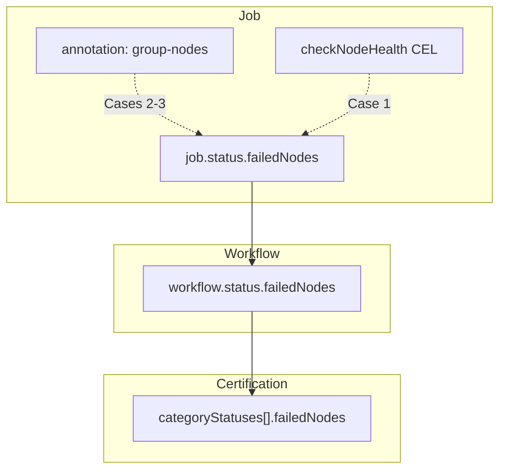

# ADR-061: Remove Remediation Controller — Failed Node Attribution via Certification CR

## Context

CRE historically created a Remediation CR when a Certification failed, and a Remediation controller applied taints, cordons, and node conditions to failed nodes (ADR-006 (internal; predates the public repository)).

This approach has several problems:

- **Ownership conflict** — In clusters with an external node lifecycle operator (e.g. NVSentinel), both systems cordon/taint the same node independently, causing double cordon and desync on cleanup.
- **Tight coupling to remediation strategy** — CRE's job is to certify nodes and identify failures. How failed nodes are quarantined or repaired is a separate concern that should not be embedded in the certification controller.
- **Cleanup desync** — Deleting the Remediation CR removes taints/cordons/conditions, potentially undoing quarantine that an external system still expects to be in place.

CRE should focus on its core responsibility: run certification tests and clearly report which nodes failed which tests. External systems can consume that signal to trigger their own remediation pipelines.

## Decision

1. **Remove the Remediation CRD and controller entirely.** CRE does not taint, cordon, or patch Node conditions.
2. **Record failed nodes on the Certification CR per category** at `status.categoryStatuses[].failedNodes`. This preserves which test failed on which node and serves as the contract for external consumers.

## Failed node attribution

### How failed nodes are identified

CRE uses a **Job → Workflow → Certification** hierarchy. Each tier has its own `failedNodes` field. Names bubble **up**; nothing is copied down.

```text
Certification  status.categoryStatuses[].failedNodes   ← []FailedNode (name + reason), per category
      ↑ copied from
Workflow       status.failedNodes                      ← []FailedNode (union across failed Jobs)
      ↑ copied from
Job            status.failedNodes                      ← []FailedNode (set when that Job fails, with per-node reason)
               metadata.annotations[group-nodes]     ← nodes in this Job's group
```

### Attribution chain



| Layer | Field |
|-------|-------|
| Job | `status.failedNodes` (`[]FailedNode` — name + reason per node) |
| Workflow | `status.failedNodes` (`[]FailedNode` — union across failed Jobs) |
| Certification | `status.categoryStatuses[i].failedNodes` (`[]FailedNode` — copied from Workflow) |

### Failure reasons

Each failed node entry carries a `reason` indicating why that specific node was marked as failed. The reason is set **per node** at the Job level, based on which code path added the node to `failedNodes`:

| Reason | Set by | Meaning |
|--------|--------|---------|
| `HardwareFailureDetected` | `setJobHardwareFailed()` | CEL health check detected cordoned/unhealthy node during the run |
| `ThresholdViolation` | `setJobValidationFailed()` | Performance threshold violated (bandwidth, goodput, step time, etc.) |
| `WorkloadFailed` | `setJobFailed()` | Workload exited non-zero, stalled, or otherwise failed |

Within the same Workflow (category), different nodes can have different reasons. For example, `gpu-01` may fail with `JobHardwareFailed` (cordoned mid-run) while `gpu-02` in another group fails with `JobValidationFailed` (bandwidth below threshold).

### Four failure cases

| Case | Trigger | `job.status.failedNodes` source | `reason` |
|------|---------|--------------------------------|----------|
| **1** | External cordon during cert | CEL health check on Job pods' nodes via `checkNodeHealth` | `HardwareFailureDetected` |
| **2** | Threshold validation fail | `cre.nvidia.com/group-nodes` annotation on the Job | `ThresholdViolation` |
| **3** | Workload exit ≠ 0 or stall | `group-nodes` annotation (comma-separated node list) | `WorkloadFailed` |
| **4** | Same node fails in **multiple categories** | Each category's Workflow independently copies into `categoryStatuses[i].failedNodes` | per-category reason (may differ across categories) |

Workflow sets `group-nodes` when creating the Job. Cases 2–3 copy from that annotation when the Job fails. Case 1 uses live pod→node mapping and CEL instead.

### End-to-end example

Certification `gpu-cluster-cert` runs two categories. Training runs one Job on `gpu-01`; the workload exits non-zero. NCCL runs two Jobs (one per node); `gpu-01` is cordoned mid-run (hardware), `gpu-02` fails bandwidth threshold.

**Job** (training — workload exit non-zero):

```yaml
apiVersion: cre.nvidia.com/v1alpha1
kind: Job
metadata:
  name: gpu-cluster-cert-training-nemotron5-8b-job-0
  annotations:
    cre.nvidia.com/group-nodes: gpu-01
status:
  conditions:
    - type: Failed
      status: "True"
      reason: WorkloadFailed
  failedNodes:
    - name: gpu-01
      reason: WorkloadFailed
```

**Job** (NCCL — hardware cordon on gpu-01):

```yaml
apiVersion: cre.nvidia.com/v1alpha1
kind: Job
metadata:
  name: gpu-cluster-cert-communication-nccl-job-0
  annotations:
    cre.nvidia.com/group-nodes: gpu-01
status:
  conditions:
    - type: HardwareFailed
      status: "True"
      reason: HardwareFailureDetected
  failedNodes:
    - name: gpu-01
      reason: HardwareFailureDetected
```

**Job** (NCCL — threshold violation on gpu-02):

```yaml
apiVersion: cre.nvidia.com/v1alpha1
kind: Job
metadata:
  name: gpu-cluster-cert-communication-nccl-job-1
  annotations:
    cre.nvidia.com/group-nodes: gpu-02
status:
  conditions:
    - type: ValidationFailed
      status: "True"
      reason: ThresholdViolation
  failedNodes:
    - name: gpu-02
      reason: ThresholdViolation
```

**Workflow** (training — single failed Job):

```yaml
apiVersion: cre.nvidia.com/v1alpha1
kind: Workflow
metadata:
  name: gpu-cluster-cert-training-nemotron5-8b
status:
  conditions:
    - type: Failed
      status: "True"
  failedNodes:
    - name: gpu-01
      reason: WorkloadFailed
```

**Workflow** (NCCL — two failed Jobs with different reasons):

```yaml
apiVersion: cre.nvidia.com/v1alpha1
kind: Workflow
metadata:
  name: gpu-cluster-cert-communication-nccl
status:
  conditions:
    - type: Failed
      status: "True"
  failedNodes:
    - name: gpu-01
      reason: HardwareFailureDetected
    - name: gpu-02
      reason: ThresholdViolation
```

**Certification** (final state — per-category, per-node reasons):

```yaml
apiVersion: cre.nvidia.com/v1alpha1
kind: Certification
metadata:
  name: gpu-cluster-cert
spec:
  categories:
    - domain: training
      variant: nemotron5-8b
    - domain: communication
      variant: nccl
status:
  conditions:
    - type: Failed
      status: "True"
  categoryStatuses:
    - domain: training
      variant: nemotron5-8b
      status: Failed
      workflowRef:
        name: gpu-cluster-cert-training-nemotron5-8b
      failedNodes:
        - name: gpu-01
          reason: WorkloadFailed

    - domain: communication
      variant: nccl
      status: Failed
      workflowRef:
        name: gpu-cluster-cert-communication-nccl
      failedNodes:
        - name: gpu-01
          reason: HardwareFailureDetected
        - name: gpu-02
          reason: ThresholdViolation
```

A terminal failed Certification (`conditions` has `type=Failed, status=True`) with non-empty `categoryStatuses[].failedNodes` is the signal that external systems can consume. Each entry identifies the node and the specific type of failure for that node.

## Implementation

### API and CRD (`api/v1alpha1/`)

**`certification_types.go`**

- `CertificationCategoryStatus.FailedNodes []FailedNode` — populated from Workflow when the category finishes. Each entry carries the node name and the failure reason.
  ```go
  type FailedNode struct {
      // name is the Kubernetes node name.
      Name string `json:"name"`
      // reason is the failure type for this node, matching the Job condition reason.
      // One of: "HardwareFailureDetected", "ThresholdViolation", "WorkloadFailed".
      Reason string `json:"reason"`
  }
  ```
- **Removed** from `CertificationStatus`: `RemediationRef *RemediationReference`
- **Removed entirely**: `RemediationReference` struct.

**Remediation CRD — deleted**

- `api/v1alpha1/remediation_types.go` — deleted
- `pkg/controller/remediation_controller.go` — deleted
- Controller registration in `cmd/manager/main.go` — removed
- CRD, RBAC roles, sample YAML, embedded files — all removed

### Job controller (`pkg/controller/job_controller.go`)

- **Change `failedNodes` from `[]string` to `[]FailedNode`** — Each code path sets the reason when adding nodes, using the same reason as the condition:
  - `setJobHardwareFailed()` → adds nodes with reason `HardwareFailureDetected`
  - `setJobValidationFailed()` → adds nodes with reason `ThresholdViolation`
  - `setJobFailed()` → adds nodes with reason `WorkloadFailed`

### Workflow controller (`pkg/controller/workflow_controller.go`)

- **Change `failedNodes` from `[]string` to `[]FailedNode`** — Copies `job.status.failedNodes` (with per-node reason) into `workflow.status.failedNodes` on **any** terminal failure.
- **Continue setting `group-nodes` on Job create** — No change needed.

### Certification controller (`pkg/controller/certification_controller.go`)

- **Per-category failed nodes with reason** — When a category's Workflow finishes with `Failed=True`, copy `workflow.status.failedNodes` directly into `categoryStatuses[].failedNodes`.
- **Removed**: `createRemediationIfNeeded()` and Remediation deletion from `handleDeletion()`.
- **Removed**: RBAC marker for `remediations` resource.

## References

- ADR-006: Remediation Lifecycle (internal; predates the public repository) — original design (superseded by this ADR)
