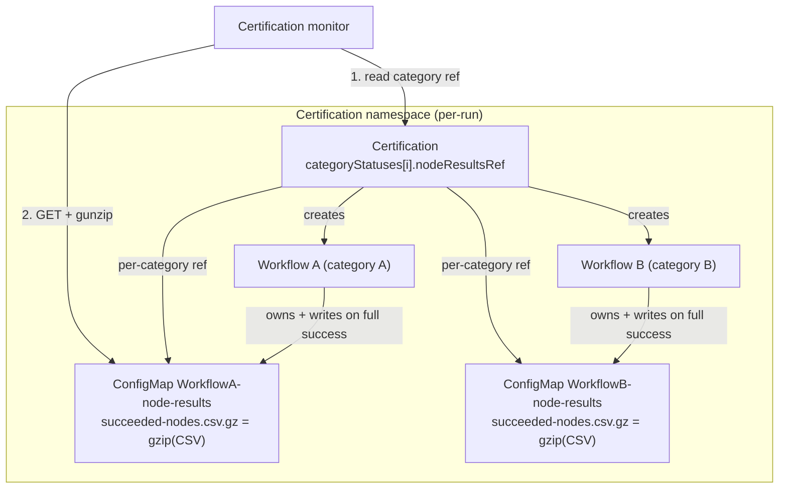

# ADR-062: Succeeded Node Attribution via a Compressed ConfigMap

## Summary

CRE reports failed nodes at `Certification.status.categoryStatuses[].failedNodes`
([ADR-061](061-cre-nvsentinel-remediation-decoupling.md)) but has no equivalent signal for
**which nodes passed**. An inline `succeededNodes []string` does not scale: at thousands of nodes the
list exceeds the ~1 MiB Kubernetes object limit and the write is rejected, wedging the controller.

**Decision:** each Workflow writes its passed-node list — gzip-compressed — into **its own ConfigMap,
named the same as the Workflow**, owned by the Workflow. The Certification references that ConfigMap
**per category** at `status.categoryStatuses[].nodeResultsRef`. The list is written **only
when the whole Workflow succeeds**; a Workflow that fails records nothing, so its category's reference
stays nil and the user knows that entire category must be re-run.

## Context

- A Certification has **one Workflow per category** (`spec.categories[]` → one Workflow each, tracked
  in `status.categoryStatuses[].workflowRef`). The Workflow runs the nodes and knows which passed.
- Kubernetes objects live in etcd, capped at ~1.5 MiB (`--max-request-bytes`); the API server /
  controllers discourage objects above ~1 MiB because every list/watch carries the whole object.
- An inline list blows this budget at scale: 6,000 nodes × ~200-char names ≈ **~1.2 MB** for one
  category. The **Workflow** is doubly exposed — `status.orchestration.groups[].nodes` already stores
  every node name, so an inline `succeededNodes` roughly doubles it past the etcd ceiling.
- An over-limit write is **rejected atomically** (`etcdserver: request is too large` /
  `Too long: must have at most 1048576 bytes`) — nothing is truncated. `Status().Update` then fails
  every reconcile and the object never reaches a terminal state. So the full list cannot live inline
  on any size-constrained CR.

## Decision

1. **No inline node list on any CR.** No `succeededNodes` field on `WorkflowStatus` or
   `CertificationCategoryStatus`.
2. **One ConfigMap per Workflow, named `<workflow-name>-node-results`.** each category creates single workflow and workflow will create one confimap which will store the details of nodes that passed this workflow test.
3. **The Workflow is the producer and writes once, on full success** — when the Workflow reaches
   terminal `Succeeded` it creates/updates its ConfigMap. A failed Workflow writes nothing, so its
   ConfigMap is absent.
4. **The ConfigMap is owned by the Workflow** (`ownerRef → Workflow`), so it is garbage-collected
   when the Workflow is deleted (which cascades from Certification deletion). No Certification lookup
   is needed to write it.
5. **gzip-compress the node list** before storing it. Node names are compressed using gzip which reduces the memory consumption by 93%.
6. **The Certification references the ConfigMap per category** at
   `status.categoryStatuses[].nodeResultsRef`, set by the Certification controller once
   that Workflow's ConfigMap exists.

## Design

### Data model

```text
Workflow "<workflow-name>"
  status.nodeResultsRef = { kind: ConfigMap, name: "<workflow-name>-node-results" }

Certification "<cert>"
  status.categoryStatuses[i].nodeResultsRef = { kind: ConfigMap, name: "<workflow-name>-node-results" }   // copied from the Workflow

ConfigMap "<workflow-name>-node-results"     (ownerRef → Workflow, same namespace)
  binaryData["succeeded-nodes.csv.gz"] = gzip("node-a,node-b,...")
```

- One ConfigMap per Workflow; since a Workflow maps to exactly one category, the ConfigMap holds the
  category's passed-node list under the key `succeeded-nodes.csv.gz`.
- The value is a gzip-compressed **comma-separated list** of node names. Node names are DNS-1123
  subdomains and can never contain a comma, so no escaping is needed; this matches the existing
  `cre.nvidia.com/group-nodes` annotation convention.
- The ConfigMap name is `categoryStatuses[i].workflowRef.name + "-node-results"`, so the reference is
  technically derivable — but it is published explicitly so consumers do not have to assume the naming rule.

### Computing the passed set

The passed set is written **only when the Workflow reaches terminal `Succeeded`** — i.e. when every
group passed. It is computed from the Workflow's own status and written once via create-or-update
(**read entry → gunzip → union → dedupe + sort → gzip → write back**; the union/dedupe keeps it
idempotent across re-reconciles). The source per mode:

| Mode | Passed set on success |
|------|-----------------------|
| Standard (full-scale, partition, multi-group, multi-iteration) | union of `orchestration.groups[].nodes` for groups in `Succeeded` phase |
| Diagnose (adaptive fault isolation) | `orchestration.diagnose.healthyNodes` (accumulated across rounds; the per-round `groups[]` only hold the last round) |

Because a Workflow only succeeds when all its groups pass, for the standard mode this is effectively
all target nodes for the category. **A failed Workflow never reaches this path, so it records
nothing.** This is deliberately not incremental: partial passes from a category that ultimately failed
are never reported as succeeded.

### Consumer contract

The certification monitor (updated in lockstep):

1. `Get` the Certification.
2. For a category, read `status.categoryStatuses[i].nodeResultsRef` (nil → that category
   recorded no passed nodes — it failed or has not finished).
3. `Get` that ConfigMap in the Certification's namespace.
4. gunzip `binaryData["succeeded-nodes.csv.gz"]` and split on `,` → passed node names.

## Architecture & flow



```mermaid
sequenceDiagram
    participant WF as Workflow controller
    participant CC as Certification controller
    participant K as kube-apiserver
    Note over WF: Workflow reached terminal Succeeded (all groups passed)
    WF->>K: CreateOrUpdate ConfigMap WORKFLOW-node-results (ownerRef Workflow)
    Note over WF: gunzip entry, union passed nodes, dedupe+sort, gzip; failed Workflow writes nothing
    CC->>K: observe the Workflow's node-results ConfigMap exists
    CC->>K: set categoryStatuses[i].nodeResultsRef = { name: WORKFLOW-node-results }
```

## Changes (by component)

### API / CRD (`api/v1alpha1/`)
- No `succeededNodes` field on `WorkflowStatus`.
- Add to `CertificationCategoryStatus`:
  - `NodeResultsRef *corev1.TypedLocalObjectReference` (`json:"nodeResultsRef,omitempty"`) — references that category's per-Workflow node-results ConfigMap (`kind: ConfigMap`, `apiGroup: nil` since ConfigMap is core). Mirrors `WorkflowStatus.NodeResultsRef`.
- No top-level `CertificationStatus` reference.
- Constant for the fixed ConfigMap key, e.g. `SucceededNodesConfigMapKey = "succeeded-nodes.csv.gz"`.

### Workflow controller (`pkg/controller/workflow_controller.go`)
- At the terminal-success sites only (`setFinalStatus` success path and `diagnoseDone`), compute the
  passed set via `succeededNodesForWorkflow` (succeeded groups' nodes, or `diagnose.healthyNodes`) and
  create-or-update a ConfigMap named `<workflow-name>-node-results`, **owned by the Workflow**
  (`SetControllerReference(workflow, cm)`), storing the gzip-CSV under the `succeeded-nodes.csv.gz`
  key. Then set `workflow.Status.NodeResultsRef` (`kind: ConfigMap`), persisted by the terminal status
  update. No write happens on the failure paths. No Certification lookup is needed.
- RBAC: add `configmaps` (`get;list;watch;create;update;patch`).

### Certification controller (`pkg/controller/certification_controller.go`)
- For the active category, copy `workflow.Status.NodeResultsRef` onto
  `categoryStatuses[i].nodeResultsRef` once the Workflow publishes it. A non-nil per-category ref
  therefore always points to a present ConfigMap. No inline node lists, no name derivation.

### Determinism
- Go's `gzip.Writer` with a zero `ModTime` produces deterministic output for the same input and
  level, so ConfigMap contents are stable across reconciles and in golden tests.

## Edge cases

| Case | Handling |
|------|----------|
| **Owner-reference namespace** | The Workflow and its ConfigMap are in the same namespace, so `ownerRef → Workflow` is valid (owner references cannot cross namespaces). The Workflow itself is owned by the Certification, so deletion cascades Cert → Workflow → ConfigMap. |
| **Workflow fails** | The failed Workflow writes nothing, so its ConfigMap is absent and `categoryStatuses[i].nodeResultsRef` stays nil. The monitor treats a nil ref as "no passed nodes for this category." |
| **Per-category ref vs CM existence** | The Certification controller sets the per-category ref only after that Workflow's ConfigMap exists, so a non-nil ref always resolves (no dangling reference). |
| **Re-run in the same / new namespace** | A namespace can't have two certificates with same name. Each workflow name is prefix with certificate name so we will never have two workflows with same name in same namespace |
| **Idempotent re-reconcile** | The write happens at terminal success and unions/dedupes, so repeated reconciles of a Succeeded Workflow are no-ops; deterministic gzip keeps bytes identical. |

## Alternatives Considered

1. **Inline `succeededNodes []string` on the Certification (and Workflow).** Rejected: cannot persist
   at 6,000+ nodes; the inline Workflow copy compounds the existing `orchestration.groups` size.
2. **One shared ConfigMap per Certification with per-category keys + a single top-level ref.**
   Rejected: it would force the Workflow (the producer) to look up and depend on its parent
   Certification, but a lower-level resource should not need to know about the higher-level one — and a
   Workflow can exist **without** a Certification (e.g. created directly or via WorkloadRun), which a
   per-Certification ConfigMap could not serve. One ConfigMap per Workflow keeps the Workflow
   self-contained: it owns and writes only its own object.
3. **Uncompressed ConfigMap.** Rejected: a ConfigMap is also capped at 1 MiB, so without compression
   it offers little headroom.

## References

- [ADR-061: Remove Remediation Controller — Failed Node Attribution via Certification CR](061-cre-nvsentinel-remediation-decoupling.md) — the `failedNodes` counterpart
- [ADR-055: Adaptive Fault Isolation](055-adaptive-fault-isolation.md) — diagnose `healthyNodes`
- [ADR-002: Layered CRD Hierarchy](002-layered-crd-hierarchy.md)
