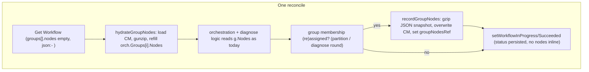
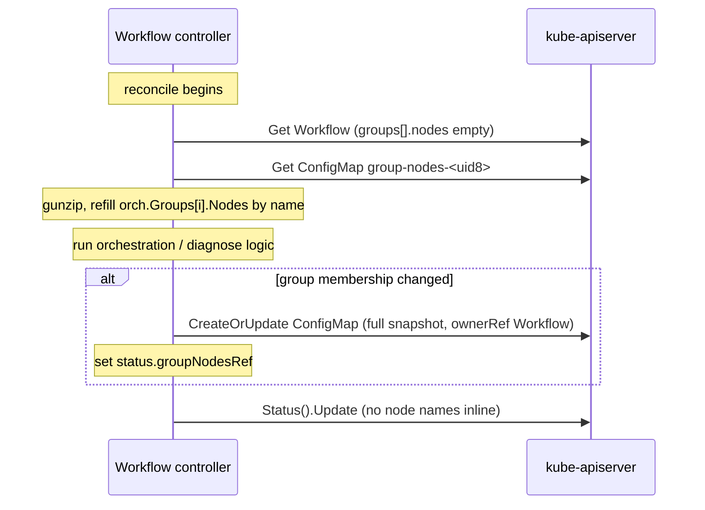

# ADR-068: Offloading Inline Node Lists from the Workflow CR via Compressed ConfigMaps

## Summary

The Workflow controller persists several lists of node names inline on the CR. The largest and most
universal is `status.orchestration.groups[].nodes`, but diagnose mode adds more (`healthyNodes`,
`screeningResults[].nodes`, and others). At thousands of nodes these lists push the object past the
~1 MiB Kubernetes object limit, the write is rejected atomically, and the controller can no longer
persist status, wedging the run.

This is the same class of problem already solved for passed nodes ([ADR-062](062-node-detail-propagation.md))
and failed nodes: move the node-name payload into a gzip-compressed ConfigMap. Group nodes are the largest
baseline contributor, present in every run, and the hardest, because unlike the report-card lists they are
the controller's live working memory, read on the hot path of every reconcile and rewritten mid-run.

**Decision:** stop persisting inline node-name lists on the Workflow CR. Each Workflow stores them as
gzip-compressed JSON in ConfigMaps it owns, hydrated into memory at the top of every reconcile and
overwritten whenever the lists change. The Go fields are kept but tagged `json:"-"` so they never
serialize. The primary case is `groups[].nodes`, stored in a `group-nodes-<uid8>` ConfigMap keyed by
group name.

**Scope:** the same mechanism applies to every inline node-name list on the Workflow CR, including the
diagnose-mode lists. See Scope for the full list.

## Context

- A Workflow partitions its target nodes into groups (`status.orchestration.groups[]`) and, in diagnose
mode ([ADR-055](055-adaptive-fault-isolation.md)), repeatedly re-groups nodes across rounds to isolate
faults. `GroupStatus.Nodes` holds the node list for each group.
- Kubernetes objects live in etcd, capped at ~1.5 MiB (`--max-request-bytes`); objects above ~1 MiB are
discouraged because every list/watch carries the whole object. 6,000 nodes x ~200-char names is on the
order of ~1.2 MB for a single Workflow, and an over-limit write is rejected atomically
(`etcdserver: request is too large`), so status can never be persisted.
- `groups[].nodes` is why ADR-062 called the Workflow "doubly exposed": the group list is the baseline
payload, and any additional inline node list compounds it. Offloading passed and failed nodes reduced
the extra copies; this ADR removes the baseline itself.


### Why group nodes are different from passed/failed nodes


|              | Passed / failed nodes (ADR-062 and its failed-node counterpart) | Group nodes (this ADR)                                                    |
| ------------ | --------------------------------------------------------------- | ------------------------------------------------------------------------- |
| When written | once, at terminal state                                         | at partition, and again on every diagnose round                           |
| Who reads it | an external monitor, later                                      | the controller itself, on every reconcile (~40 read sites)                |
| Role         | terminal "report card"                                          | live "working memory" for job creation, node-overlap checks, and diagnose |


Because the controller needs this data live on every reconcile, we cannot simply write it and walk away.
If the node lists live only in a ConfigMap, they must be reliably loaded back into memory before any
orchestration logic runs.

## Decision

1. **No persisted node list on the CR.** `GroupStatus.Nodes` keeps its Go type but changes its JSON tag
  to `json:"-"`, so it is never serialized and drops out of the CRD schema. All existing in-memory reads
   of `group.Nodes` are unchanged.
2. **One ConfigMap per Workflow, named** `group-nodes-<uid8>`, derived from the Workflow UID via the
  existing `nodeResultsCMName` helper, owned by the Workflow (`ownerRef -> Workflow`) so it is
   garbage-collected when the Workflow (and its parent Certification) is deleted.
3. **Payload is gzip-compressed JSON** of `map[groupName][]string`, under the key `group-nodes.json.gz`.
  JSON (not CSV) because the group-to-nodes mapping must be preserved; this matches the failed-nodes JSON
   precedent and reuses the shared gzip helpers.
4. **The Workflow rehydrates on read.** At the top of each reconcile the controller loads the ConfigMap,
  gunzips it, and refills `orch.Groups[i].Nodes` by matching group name, before any logic runs.
5. **The Workflow overwrites on membership change.** At the two points where membership is assigned
  (initial partition and each diagnose round), the controller writes a full snapshot of the current
   `group -> nodes` map (overwrite, not merge) and sets `status.groupNodesRef`.


## Design


### Data model

```text
Workflow "<workflow-name>" (uid <uid>)
  status.groupNodesRef = { kind: ConfigMap, name: "group-nodes-<uid8>" }

ConfigMap "group-nodes-<uid8>"     (ownerRef -> Workflow, same namespace)
  binaryData["group-nodes.json.gz"] = gzip(JSON {"group-0":["node-a","node-b"], "group-1":[...]})
```

- One ConfigMap per Workflow holds every group's node list, keyed by group name.
- The ConfigMap name is derived from the Workflow UID, so hydration can always find it even if
`groupNodesRef` was not yet persisted (for example if the controller crashed between writing the
ConfigMap and updating status). The ref is still published explicitly so consumers do not have to
assume the naming rule.


### Write points (exactly two)

`GroupStatus.Nodes` is only ever assigned in two places, so those are the only places that must persist
the ConfigMap:


| Write point          | Location                                        | When                                                         |
| -------------------- | ----------------------------------------------- | ------------------------------------------------------------ |
| `buildGroupStatuses` | partition path (`workflow_controller.go` ~L339) | initial node partitioning                                    |
| `diagnoseSetGroups`  | `workflow_controller.go` ~L1501                 | every diagnose round (all diagnose stages funnel through it) |


Each call writes a **full snapshot** and overwrites the `group-nodes.json.gz` key. This differs from the
passed/failed-node recorders, which union because those lists only grow; group membership can shrink
across diagnose rounds, so a merge would leave stale nodes and corrupt fault isolation. Full-snapshot
writes are also self-healing: every save is the complete current truth.

### Read points (must be hydrated first)

- **Internal:** ~40 sites in `pkg/controller/workflow_controller.go` (job creation node selector and
`group-nodes` annotation, `hasNodeOverlap`, `collectAllDomainNodes`, `buildInterDomainGroup`, and the
diagnose/bisection path). These are unchanged once hydration runs first.
- **External:** `pkg/report/report.go` reads `orch.Groups[].Nodes` directly from the CR. Since it does
not run the controller's hydration, it must load and decode the ConfigMap itself before rendering.
- The per-Job `cre.nvidia.com/group-nodes` annotation (one group's nodes, set at job creation and
read by failed-node attribution and `getJobNodes`) is small and unchanged.


### Consumer contract

1. `Get` the Workflow.
2. Read `status.groupNodesRef` (nil -> no groups persisted yet), or derive `group-nodes-<uid8>`.
3. `Get` that ConfigMap in the Workflow's namespace.
4. gunzip `binaryData["group-nodes.json.gz"]` and JSON-decode to `map[groupName][]string`.


## Architecture and flow







## Changes (by component)


### API / CRD (`api/v1alpha1/`)

- Change `GroupStatus.Nodes` tag from `json:"nodes"` to `json:"-"` (kept as an in-memory field).
- Add `WorkflowStatus.GroupNodesRef *corev1.TypedLocalObjectReference` (`json:"groupNodesRef,omitempty"`,
`kind: ConfigMap`, `apiGroup: nil`).
- Constant for the fixed key, e.g. `GroupNodesConfigMapKey = "group-nodes.json.gz"`.
- Run `make manifests generate` (drops `nodes` from the Workflow CRD schema, adds `groupNodesRef`, and
regenerates deepcopy).


### Encode/decode (`pkg/noderesults/`)

- Add `GroupNodesToJSON(map[string][]string)`, `GroupNodesFromJSON`, and
`DecodeGroupNodesFromConfigMap(*corev1.ConfigMap)`, reusing the existing gzip helpers.


### Workflow controller (`pkg/controller/`)

- `recordGroupNodes(ctx, workflow, orch)`: build the `group -> nodes` map, gzip-JSON it, `CreateOrUpdate`
the `group-nodes-<uid8>` ConfigMap with `SetControllerReference(workflow, cm)`, overwrite the key, and
set `status.groupNodesRef`. Call it at the two write points, before the corresponding status update.
- `hydrateGroupNodes(ctx, workflow)`: called right after orchestration status is ensured; loads the
ConfigMap (by ref or derived name), gunzips, refills `orch.Groups[i].Nodes`. No-op when the ConfigMap
does not yet exist. Add a fail-closed guard: if the Workflow is past partition (groups exist) but
hydration yields empty node lists and no ConfigMap is found, requeue rather than act on empty lists.
- `succeededNodesForWorkflow` (from ADR-062) reads `orch.Groups[].Nodes`, so hydration must remain ahead
of terminal-success recording.
- RBAC: `configmaps` (`get;list;watch;create;update;patch`) is already granted; no change.


### ncrectl (`pkg/report/report.go`)

- Load and decode the `group-nodes-<uid8>` ConfigMap and populate group nodes/counts before rendering,
so reports do not show empty node lists.


### Determinism

- Go's `gzip.Writer` with a zero `ModTime` and stable (sorted) JSON key ordering produces deterministic
bytes, keeping ConfigMap contents stable across reconciles and in golden tests.


## Edge cases


| Case                                         | Handling                                                                                                                                |
| -------------------------------------------- | --------------------------------------------------------------------------------------------------------------------------------------- |
| **Owner-reference namespace**                | Workflow and ConfigMap share a namespace, so `ownerRef -> Workflow` is valid; deletion cascades Certification -> Workflow -> ConfigMap. |
| **First reconcile / no ConfigMap yet**       | Hydration is a no-op; groups are empty until partition writes them.                                                                     |
| **Diagnose shrinks groups**                  | Full-snapshot overwrite replaces the map each round, so nodes ruled out in prior rounds do not linger.                                  |
| **Crash between CM write and status update** | The ConfigMap name is derived from the Workflow UID, so the next reconcile still finds and hydrates it.                                 |
| **Empty hydration past partition**           | Fail-closed guard requeues instead of launching jobs on zero nodes.                                                                     |
| **Cache staleness after write**              | Nodes are already in memory within the reconcile that wrote them; cross-reconcile the watch cache converges.                            |


## Migration and upgrade

With `json:"-"`, a controller running this change cannot read `nodes` from Workflows created by the prior
controller, and those Workflows have no ConfigMap yet, so in-flight runs would hydrate empty. Because
certification runs are short-lived and live in unique per-run namespaces, the recommended path is to let
in-flight runs finish before rolling out. If zero-downtime upgrade of in-flight runs is required, a
one-time fallback can read the legacy inline `nodes` (via a temporary shadow field or unstructured decode)
and write it into the ConfigMap on first reconcile; this choice also favors `json:"nodes,omitempty"` plus
always clearing the field over a hard `json:"-"`.

## Alternatives considered

The following approaches were considered and not chosen. The first four are variations on where and how to
store or load the node lists; the last, node labels and selectors, is a fundamentally different data model
and is covered in depth.

1. **Mirror to a ConfigMap but keep** `groups[].nodes` **inline.** Matches the passed/failed pattern exactly
  and is low-risk, but does not shrink the CR, so it does not solve the 1 MiB problem for group nodes.
   Rejected: it is decorative for this use case.
2. **Delete the** `Nodes` **field and thread a** `map[groupName][]string` **through the orchestration code.**
  Rejected: it churns all ~40 read sites and the delicate diagnose logic, for no benefit over keeping the
   field as an in-memory, non-serialized cache.
3. **Lazy hydration (load only in code paths that read nodes).** A valid optimization over top-of-reconcile
  hydration, but reads come from the controller's local cache and gunzip is sub-millisecond, so the simple
   single-choke-point approach is cheap enough. Kept as a future optimization, not the initial design.
4. **Uncompressed ConfigMap.** Rejected: a ConfigMap is also capped at ~1 MiB, so without compression it
  offers little headroom.


### Node labels and selectors

Instead of storing the group-to-node mapping in an object the controller owns, this approach records
membership directly on the Node objects as labels and recomputes group membership on demand with a label
selector. This section describes how it would work end to end; the trade-offs follow afterwards.

Labelling would be owned by the Workflow controller and applied at the two points where it already assigns
group membership: initial partitioning and each diagnose round. Because it writes to Node objects, the
controller needs `nodes` `patch` and `update` RBAC.

A node can carry many labels at once, so membership is encoded as one presence-style key per group rather
than a single key whose value is the group name. This is what lets a node belong to more than one group at
the same time, which happens with overflow and borrowed nodes and during diagnose confirmation. A node in
group-0 carries `group.cre.nvidia.com/<uid8>.group-0="true"`; if it is also borrowed into
group-2-overflow it additionally carries `group.cre.nvidia.com/<uid8>.group-2-overflow="true"`. Each
Workflow's keys are scoped by its UID (`<uid8>`), so a node shared between two concurrently running
Workflows carries an independent set of keys per run and the two never overlap. A group's members are then
whatever match the selector `-l group.cre.nvidia.com/<uid8>.group-0`.

At partition the controller adds each node's group key(s), so a shared node receives one key per group it
belongs to. In diagnose mode the groups are recomputed every round, so on each round the controller adds
keys for new memberships and removes keys for memberships that no longer hold; a node confirmed into a
second group simply gains a second key.

Because a label is not an object with its own lifecycle, removing it is explicit work the controller must
do. It would strip a node's keys at three points: on completion, once a group or the whole Workflow
finishes; on deletion, by extending the existing Workflow finalizer (`cre.nvidia.com/workflow-finalizer`)
to strip every labelled node before the finalizer is released; and through a periodic sweep that removes
keys whose owning Workflow no longer exists or has already completed. For a shared node, removal on
completion first confirms no other still-running group needs the node before dropping its key, a form of
reference counting.

With that mechanism in mind, the trade-offs are:

What is good about it:

- It is the most size-proof option of all. Membership lives as tiny labels spread across the Node objects,
and the Workflow only remembers a selector, so there is no blob and no object-size concern at all.
- It leans on a first-class Kubernetes mechanism that everyone already understands, and job creation
already selects nodes.
- It updates itself to reality. If a node is deleted, the selector simply stops returning it, so there are
no stale names to clean up.
- Membership is visible with a simple `kubectl get nodes -l ...`.

What is not so nice:

- Labels live on shared Node objects that operators, other controllers, and automation can all edit. One
stray `kubectl label` can quietly change a group's membership in the middle of a run, corrupting a
diagnose round or sending a job to the wrong nodes. The Workflow does not own this state.
- It requires re-granting the controller node-write (`nodes` `patch`/`update`) RBAC that ADR-061
deliberately removed, reversing that decision.
- It writes to shared objects far more often. Because diagnose re-groups every round, the controller
re-patches many nodes each round (versus one ConfigMap write), and every patch competes with other
systems writing to the same Node objects, such as NVSentinel and gpud.
- A node can hold plenty of labels, so the count is not the problem; the cost is management. Each
(run, group) key has to be added at the right moment and, crucially, removed later on a node the controller
does not own, and a heavily-shared node accumulates several such keys at once.
- It forgets intent. Once a key is removed, you can no longer tell that a node was ever in group-0, which
is useful for attribution and retries.
- Cleanup is never guaranteed the way the ConfigMap's owner-reference garbage collection is. Even with
removal on completion, finalizer cleanup, and a periodic sweep, leak windows remain: a crash between
labelling a node and recording it, a force-deleted Workflow whose finalizer is stripped, or a shared node
whose last group fails to recognize it is the last.

Rejected: it places run-critical state on shared, mutable Node objects the Workflow does not own, requires
reversing ADR-061 to re-grant node-write RBAC, and offers no guaranteed cleanup, all to avoid a single
owned ConfigMap that the chosen approach already handles cleanly.

## Scope

The decision applies to every inline node-name list persisted on the Workflow CR, not just group nodes.
They all share the same shape (node names that scale with cluster size, read and rewritten on the reconcile
hot path) and therefore the same fix: gzip-compressed JSON in a Workflow-owned ConfigMap, hydrated on read
and overwritten on change. The detailed design above uses group nodes as the concrete example; the other
lists reuse the same mechanism.

### Inline node lists in scope

| Field                                                                 | Shape                       | Scales with node count |
| --------------------------------------------------------------------- | --------------------------- | ---------------------- |
| `orchestration.groups[].nodes`                                        | `[]string` per group        | Yes (baseline)         |
| `diagnose.healthyNodes`                                                | `[]string`, accumulated     | Yes                    |
| `diagnose.screeningResults[].nodes` / `noNVLScreeningResults[].nodes` | `map[domain]{nodes,passed}` | Yes                    |
| `diagnose.suspectNodes` / `noNVLSuspectNodes`                         | `[]string`                  | Bounded by failures    |
| `diagnose.representativeNodes`                                         | `[]string`, one per domain  | No                     |
| `diagnose.infrastructureFaults[].groupA/groupB`                       | `[]string` pairs            | Bounded                |
| `diagnose.crossBoundaryState.pendingProbes[].halfA/halfB`             | `[]string` pairs            | Bounded, transient     |

The size-critical fields beyond group nodes are `healthyNodes` and the two `screeningResults` maps; the
rest are small but ride along on the same mechanism to keep the CR free of node names entirely.

### Unified mechanism (reuse, not per-field one-offs)

Because every field is the same pattern, they share one generic offload helper rather than a bespoke path
per field: a gzip-plus-JSON codec keyed by list name, a single hydration step that loads the Workflow's
ConfigMap(s) once and refills each field, and a single overwrite-on-change step at the write points.
Diagnose already re-groups and writes status every round, so the same hydrate-before-read /
overwrite-on-change choke points established for group nodes extend to these fields with no new control
flow.

Storage layout: the diagnose lists live in a dedicated `diagnose-nodes-<uid8>` ConfigMap (one owned
object, one key per list, for example `healthy.json.gz`, `suspect.json.gz`, `screening.json.gz`),
consistent with the per-purpose ConfigMaps already used for succeeded, failed, and group nodes. One `Get`
hydrates all diagnose lists; writes touch only the changed keys.

## Consequences

- **Positive:** the Workflow CR no longer grows with node count, so large runs no longer risk wedging on an
over-limit status write. Reuses the ADR-062 gzip/ConfigMap infrastructure and RBAC.
- **Negative:** node membership is no longer visible via `kubectl get workflow -o yaml`; use the ConfigMap
or `ncrectl report` (which reads the ConfigMap with the user's kubeconfig, so users need `get configmaps`
in the run namespace). Correctness now depends on hydrate-before-read and overwrite-on-change discipline,
mitigated by the single hydration choke point, the single assign-and-save helper, and the fail-closed
guard. Test churn is significant: many fixtures and golden files reference the inline node lists.


## References

- [ADR-062: Succeeded Node Attribution via a Compressed ConfigMap](062-node-detail-propagation.md) - the passed-node counterpart and shared gzip/ConfigMap plumbing
- [ADR-061: Remove Remediation Controller, Failed Node Attribution via Certification CR](061-cre-nvsentinel-remediation-decoupling.md) - the failed-node counterpart
- [ADR-055: Adaptive Fault Isolation](055-adaptive-fault-isolation.md) - diagnose grouping and `healthyNodes`
- [ADR-002: Layered CRD Hierarchy](002-layered-crd-hierarchy.md)

