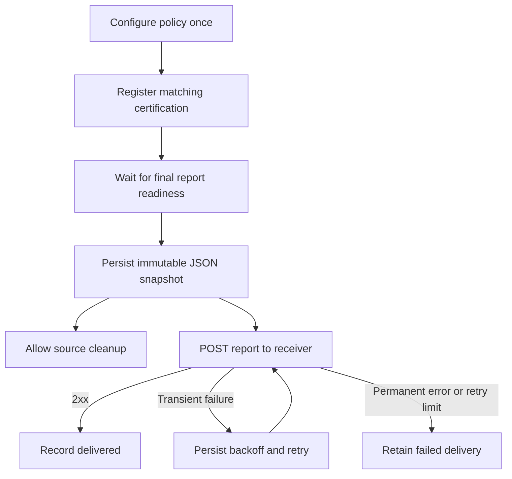

# ADR-082: Durable Certification Report Delivery over HTTP

**Status:** Accepted

**Date:** 2026-09-30

## Context

Certification results can be printed by `nvcrectl` or written to a local JSON
file. A service consuming those results must currently keep a CLI process alive,
retrieve the report, and arrange its own delivery. Kubernetes lifecycle Events
are useful diagnostics, but they are neither complete reports nor a durable
delivery queue.

A cluster operator needs to configure an HTTP destination once and receive the
final reports of subsequent matching Certifications. Delivery must survive a
controller restart and the cleanup of an individual certification. The first
version must work without an object store, database, or Alertmanager.

The existing report builder tolerates some API read failures, and a parent
Certification can temporarily report Failed while a repeated child Workflow
continues. Neither a single terminal condition nor a best-effort report is enough
to establish that a final report is ready. The CLI cleanup and setup reset paths
also delete resources on which report construction depends.

## Decision

### Persistent configuration and per-run records

Introduce two namespaced resources:

- `ReportExportPolicy` selects Certification namespaces and labels, and defines
  one webhook URL, an optional same-namespace bearer-token Secret reference,
  request timeout, retry bounds, retention, and suspension.
- `ReportExport` records one policy/source pair. Its immutable delivery inputs
  include the source UID, policy UID and generation, destination configuration,
  and stable report identifier. Only explicit cancellation and retry-request
  controls are mutable. The status records snapshot readiness, delivery outcome,
  attempts, deadline, next retry, last HTTP status, and sanitized errors.

Keep policies, exports, authentication Secrets, and snapshots in a dedicated
reporting namespace. Only administrators of that namespace may configure
cross-namespace exports. Limit Secret reads to that namespace; credentials must
never be copied into reports, status, Events, or logs.

Register export intent before starting a matching Certification's Workflows.
Select only Certifications created after a policy was created. Do not backfill
historical runs automatically. Freeze the matching policy and delivery settings
when registering the intent; later changes apply to subsequent registrations.
Use source and policy UIDs, not names, for deterministic export names and request
identifiers. Multiple matching policies produce independent exports.

Store the frozen registration in an immutable ConfigMap in the reporting
namespace, keyed by source UID. The source annotation is only a reference:
ordinary source submitters can change annotations, so it must never authorize
a destination or a Secret read. Empty selections are also recorded to prevent
later label or policy changes from changing an already registered run. Bound
each registration to 32 policies and 64 KiB; reclaim it once the source and
its delivery records are gone. Use an uncached client for this namespace so
the certification manager needs only namespace-scoped registration access.

Suspension or deletion of a policy stops new registrations. Existing exports
continue with their frozen settings until completed or explicitly cancelled.
Read the referenced Secret for each attempt so token rotation takes effect
without changing the destination or report identity.

### Report readiness and immutable payloads

Provide a strict report-building path shared with the existing report model.
Distinguish a pending result, legitimate unavailable measurements after an early
failure, and a failed API read. Confirm referenced Workflows, iteration state,
and applicable measurements have settled before freezing a final report.
An API or decoding failure must not become an empty metric or an empty failed
node list. A Certification rejected before creating a Workflow is still a valid
failed run; it must not wait for a child that was never created.

The JSON envelope contains a schema version, stable report ID, cluster/source
identity, generation time, and the existing structured report. PASSED, FAILED,
and INCOMPLETE are all delivered. RUNNING is not a final-report event.

Persist the exact JSON bytes, gzip-compressed, in an immutable ConfigMap owned
by the ReportExport in the reporting namespace. Store its reference, raw byte
count, and SHA-256 digest in status. Reconcile creation by deterministic name and
validate ownership and content before adopting an existing snapshot. A crash
between ConfigMap creation and the status update must not produce a second
payload. All attempts use the stored bytes.

Bound raw JSON at 8 MiB and compressed data at 512 KiB. Exceeding either bound
records PayloadTooLarge and retains the source for operator action. Never
truncate a complete report to fit. These are explicit supported sizes, not a
claim that compression makes every report fit a Kubernetes object.

### HTTP delivery and recovery

Send a JSON POST with `Content-Type: application/json` and a stable
`Idempotency-Key` equal to the report ID. HTTPS certificate validation remains
enabled; do not follow redirects. An explicit deployment setting may allow
plain HTTP for development. Authentication uses the referenced Secret.

Treat 2xx as acceptance by the receiver, not proof that its asynchronous business
processing has finished. The receiver should persist or durably enqueue the
report before acknowledging it. Treat transport errors, 408, 429, and 5xx as
retryable. Honor Retry-After for 429 and 503 within the delivery deadline. Other
4xx and redirects terminate that delivery cycle with an actionable error.
Responses have a bounded body; neither response bodies nor payloads are logged.

Use exponential backoff with jitter. Suggested defaults are a 10-second request
timeout, 10-second initial backoff, 15-minute maximum backoff, 100 attempts, and a
24-hour delivery window. The attempt budget or deadline, whichever is reached
first, ends automatic retries. Persist attempt/deadline state before sending;
on restart, resume from persisted state. Leadership coordination reduces
concurrent work but does not provide exactly-once delivery.

A receiver can accept a request whose response is lost, or the exporter can
crash before recording success. Repeated requests are therefore expected.
Receivers must deduplicate by the stable identifier. Manual retries retain the
same snapshot and identifier, create a new bounded retry cycle, and preserve
the cumulative attempt history. Explicit cancellation stops subsequent attempts
but cannot recall an in-flight request.

### Source cleanup and deployment lifetime

Run the exporter separately from the certification manager, using the same
repository and release image where practical. Its Deployment and delivery data
must not be owned by an individual Certification or be uninstalled by a
per-run setup/reset cycle. Already-frozen payloads must remain deliverable even
if core NVCRE CRDs have subsequently been removed.

Certification deletion must check registered exports before deleting any child
Workflow. Allow source cleanup when every registered export has a durable
snapshot or has been explicitly cancelled/skipped. Do not wait for the HTTP
receiver. This guard belongs in the existing deletion path: a second finalizer
alone would not order it before child cleanup.

The CLI must stop destructive cleanup if the snapshot/deletion wait fails,
rather than continuing to delete the namespace or uninstall the manager.
Setup reset must preserve the report CRDs and reporting installation instead
of deleting every CRD in the NVCRE API group indiscriminately.

Deleting a still-running Certification cancels final-report preparation and
records SourceDeletedBeforeCompletion; a CLI timeout is not a fabricated failed
certification. Force-removing finalizers or deleting an entire source/reporting
namespace outside the controlled cleanup path is outside the delivery guarantee.

### Retention and duplicate prevention

Suggested payload retention is seven days after successful delivery and thirty
days after final failure. Keep a compact delivery record while the original
source UID still exists, even after the payload expires, so resync cannot
recreate and resend an already-processed export. Once the source is gone, remove
the record after retention has elapsed. Expired payloads cannot be manually
retried and must report that fact explicitly.

Snapshot ConfigMaps may be owned by their same-namespace ReportExport. Exports
must not be owned by the source Certification or policy, because deleting either
must not discard a pending delivery. Apply namespace resource quotas; storage
exhaustion must be visible and must not silently discard a report.

## Implementation

1. Define and validate the policy/export APIs and regenerate manifests and
   DeepCopy code before compiling consumers.
2. Extract the strict report collection/readiness boundary. Keep existing CLI
   report behavior compatible and avoid a report/controller import cycle.
3. Implement policy registration, deterministic export identity, immutable
   snapshot persistence, and HTTP delivery reconciliation.
4. Add a separately runnable exporter with scoped Secret access, leadership
   coordination, health probes, and installable manifests or a separate chart.
5. Integrate the source-deletion guard, CLI cleanup failure propagation, and
   reset preservation of the reporting installation and CRDs.
6. Add report API/operations documentation, configuration samples, public-site
   navigation, and tests for the lifecycle and transport contracts.

## Rationale

Policy and delivery have different lifetimes. Separating them gives operators
one persistent configuration while retaining per-run status and recovery.
Storing the request before sending decouples source cleanup from receiver
availability. Kubernetes API persistence supplies restart recovery without an
additional service, within an explicit report-size and retention budget.

## Consequences

- The feature adds two CRDs and an optional reporting installation.
- The source controller and CLI need a local persistence handshake before
  cleanup, but no external HTTP call is added to certification reconciliation.
- Export failures do not change the certification's pass/fail result.
- Receivers need idempotent acceptance. A successful response is an acceptance
  contract; end-to-end downstream processing is outside NVCRE's scope.
- Oversized reports or unavailable API storage require operator action before
  safe automatic cleanup. This first version is not an unlimited archive.

## Alternatives Considered

- **POST directly from certification reconciliation:** couples certification
  progress to an external service and loses retry intent after cleanup.
- **Forward Kubernetes Events:** lacks the complete report and a durable
  delivery history.
- **CLI-only webhook flag:** requires an attached process and does not cover
  declaratively submitted Certifications.
- **Object storage or a PVC-backed queue:** accommodates larger reports but
  adds infrastructure beyond the first version's requirements.
- **ConfigMap-only configuration and delivery annotations:** saves a CRD but
  loses a typed, validated policy/status interface.
- **Snapshot finalizer without changing deletion:** does not prevent another
  controller from deleting the report's child resources first.

## Notes

Validation must exercise readiness after repeated iterations, early failures,
missing references, source UID replacement, policy changes, retries after an
ambiguous response, restart recovery, payload limits, retention, and cleanup
while the receiver is unavailable. New structured tests follow
`testutil.TestCaseParser`; generated expectations require review.

## References

- [Feature discussion: issue #397](https://github.com/NVIDIA/cluster-readiness-engine/issues/397)
- [ADR-061: External consumption of certification results](061-nvcre-nvsentinel-remediation-decoupling.md)
- [ADR-068: Compressed ConfigMap storage](068-group-nodes-compressed-configmap.md)
- [ADR-072: Terminal measurement freeze](072-goodput-terminal-freeze.md)
- [ADR-080: Lifecycle Events](080-phase-transition-events.md)
- [Kubernetes ConfigMaps](https://kubernetes.io/docs/concepts/configuration/configmap/)
- [Kubernetes finalization](https://kubernetes.io/docs/reference/using-api/api-concepts/#resource-deletion)
- [HTTP semantics](https://www.rfc-editor.org/rfc/rfc9110.html)
